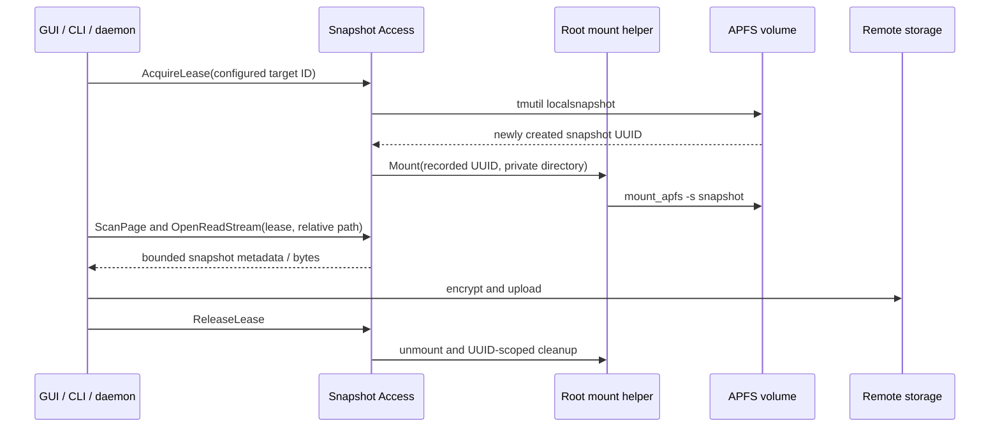

# Strict APFS Snapshot Backup Without Exposing User Data

## Context

A directory backup that walks live files cannot promise that every file came from one point in
time. APFS local snapshots provide a read-only timepoint, but macOS separates three authorities:

- creating and reading files protected by TCC / Full Disk Access (FDA),
- mounting an APFS snapshot, and
- encrypting, indexing, and uploading backup data.

Combining those authorities in a root backup daemon would make the blast radius unnecessarily
large. Copying the entire source tree to a staging directory avoids the mount boundary but is not
acceptable for large sources and still does not replace application-level transaction semantics.

The solution is a brokered, fail-closed snapshot reader: a user-session app owns snapshot file
reads, a minimal root service owns only the mount lifecycle, and the ordinary backup daemon receives
only directory entries and bounded byte streams.

## Locked Design

```text
normal GUI / CLI / daemon
  - scheduling, Keychain, encryption, chunking, upload, indexes
  - no root privilege
  - no snapshot mount path

Snapshot Access.app (logged-in user)
  - FDA boundary and configured-target allowlist
  - tmutil localsnapshot
  - unique snapshot discovery and user-owned lease journal
  - scans and opens files only below the private snapshot mount
  - IPC: metadata pages and bounded read streams

Snapshot Mount Helper (root LaunchDaemon)
  - Mount, Release, Status, UUID-scoped Cleanup only
  - mount_apfs, umount, and exact recorded UUID deletion
  - no source file opens, Keychain, encryption, indexes, or network access
```

The daemon retains the logical source path for backup history and manifests. It does not receive the
physical mount path. A strict backup uses a configured target ID to acquire an opaque lease, then
uses that lease for scan and stream requests. A lease is released as soon as source bytes have been
queued for encryption/upload; the remaining pipeline has no snapshot dependency.



## Invariants

1. Strict mode is opt-in by APFS Volume UUID. Non-APFS, insufficient free space, unavailable
   service, ambiguity while identifying the newly-created snapshot, nested mounts, read errors, and
   pending cleanup are blocking conditions.
2. Strict mode never falls back to a live directory scan. A precondition or broker-read failure
   publishes no Backup Snapshot remotely.
3. The Access IPC accepts configured target IDs, leases, and relative paths only. It rejects
   arbitrary source paths, parent traversal, absolute paths, symlink file reads, and cross-UID use.
4. The root helper mounts only a UUID present in the Access app's recorded manifest. It cleans up
   only that manifest; it never deletes a snapshot discovered by name alone.
5. There is at most one active lease and one coalesced pending run per volume. A cleanup-pending
   volume is blocked until its recorded resources are recovered.
6. Snapshot mount directories are private to the owning user. The daemon cannot substitute a mount
   path or bypass the Access IPC.

## Permission Model

| Operation | Component | Authority | Normal backup prompt |
| --- | --- | --- | --- |
| Snapshot creation and snapshot file reads | Snapshot Access.app | FDA for the exact installed app identity | No |
| Snapshot mount, unmount, UUID cleanup | Root mount helper | root LaunchDaemon plus FDA for the exact helper identity in the currently validated baseline | No |
| Keychain, encryption, indexes, upload | Backup daemon | ordinary user | No |
| Install/update/remove mount helper | installer / CLI | administrator authorization | Yes, only for that transaction |

FDA is tied to an exact application identity and path. An ad-hoc signed replacement can require
the owner to grant FDA again. Strict mode must display a blocking state in that case; it must never
quietly read the live source.

The locked deployment baseline grants FDA to both Snapshot Access and the root mount helper. The
helper's protocol and code path remain mount-only, but the validation that established feasibility
gave both exact identities FDA. It is therefore incorrect to market an Access-only FDA requirement
until the same release has passed the timepoint test after the helper's FDA authorization is removed.
That future least-privilege experiment is optional optimization work, not a prerequisite for this
solution. The settings and installation guidance must list every FDA-authorized identity in the
known-good baseline.

## Why the Read Is From the Snapshot

The essential proof is a timepoint mutation, not merely a matching hash of an unchanged file:

```text
write live/<random probe> = PRE
acquire lease: create and mount snapshot
overwrite live/<same probe> = POST
read lease/<same relative probe>

assert snapshot bytes == PRE
assert live bytes     == POST
release lease and delete the probe
```

`PRE` cannot be obtained by opening the live equivalent path after it has been overwritten with
`POST`. The implementation constructs every read root from the lease's private mount root plus the
configured source-relative path, and never from the logical live source path.

## Privacy-Preserving Evidence

Raw integration transcripts are private diagnostic material: they can contain configured source
paths, target IDs, volume identifiers, snapshot UUIDs, mount roots, and base64 test bytes. They must
not be attached to issues, pull requests, chat, or release notes.

Use the integration verifier's sanitized mode when shareable evidence is needed:

```bash
bash scripts/macos/verify-apfs-snapshot-integration.sh --sanitized \
  '<configured-target-id>:<controlled-source-root>'
```

The controlled source root may be an empty directory created for the test on an already configured
APFS target. The verifier creates only one randomly named probe in that root, and the probe contains
only generated `PRE` / `POST` test values. It does not enumerate, hash, upload, or print existing
user files.

On success, the only stdout record is shaped as follows:

```json
{
  "schema": "televybackup.apfs_snapshot_evidence.v1",
  "result": "passed",
  "cases": 1,
  "assertions": {
    "snapshotReadPreMutation": true,
    "liveMutationObserved": true,
    "leasesReleased": true,
    "cleanupComplete": true
  },
  "redacted": [
    "sourcePath",
    "targetId",
    "volumeUuid",
    "snapshotUuid",
    "mountRoot",
    "testBytes",
    "rawIpc"
  ]
}
```

In sanitized mode the raw IPC transcript is placed in a temporary private directory only while the
test runs, then removed on both success and failure. The report intentionally excludes hostnames,
usernames, paths, disk names, serials, snapshot IDs, timestamps, configuration, and backup data.
It makes no network request.

The privacy claim applies to the produced evidence artifact. It does not attempt to defend against
another process already running as the same macOS user, which could inspect process arguments or
user-owned temporary files; that threat model is outside this design's local IPC boundary.

This report is reproducible functional evidence, not independent cryptographic attestation: a JSON
result alone can be fabricated. To review it meaningfully, pair it with the exact source revision,
the verifier source, reproducible build checks, and the unit tests below. Do not publish raw logs to
make a boolean report appear stronger.

## Residual Risks

The sanitized report contains no personal filesystem data or host topology, but no useful system can
make the implementation's authority risk zero. The root helper is intentionally small because a
defect in a root process is high impact, and FDA granted to that helper is a deployment-level
capability even though the accepted IPC has no file-read method. The mitigations are a fixed command
allowlist, peer-UID checking, source-volume and private-mount validation, UUID-manifest cleanup, and
the separation that keeps encryption, Keychain material, indexes, and networking out of the helper.

This solution also provides filesystem timepoint consistency, not application transaction
consistency. A database or application that needs a quiesced or transactionally coordinated backup
must provide its own documented backup/export mechanism.

## Evidence Ladder

| Level | What it establishes | Safe artifact |
| --- | --- | --- |
| Protocol/unit tests | Request allowlists, peer UID binding, private mount validation, UUID-only cleanup | Test names and pass/fail counts |
| Brokered core tests | The daemon uses streams rather than a mount path; strict errors fail closed | Test names and pass/fail counts |
| Sanitized APFS integration | `PRE` survives in snapshot while live file is `POST`; cleanup completes | Sanitized JSON assertion report |
| Package verification | One product bundle contains the independent Access helper and the mount-helper artifact | Artifact names, component hashes, and identity fields, if desired |
| Product backup smoke test | Existing upload pipeline can consume brokered bytes | Private local result; never publish target or remote metadata |

The first three levels establish feasibility without disclosing user data or machine topology. The
last level validates the pre-existing upload pipeline and should remain a local owner-controlled
operation because backup history and remote metadata are sensitive.

## Operational Procedure

1. Build the main app and mount-helper from one source revision; embed Snapshot Access inside the
   main app and register it through `SMAppService`.
2. Let the main app migrate the old external registration transactionally. Install the root helper
   through the explicit administrator transaction; do not run the daemon as root.
3. Grant FDA only through System Settings to the exact displayed identity or identities required by
   the validated deployment baseline.
4. Probe each configured target. Enable strict mode only after the target reports APFS support and
   its Volume UUID is persisted.
5. Before a release or when the access-app identity changes, run the sanitized timepoint verifier
   against a controlled configured root. Retain only its sanitized JSON result.
6. Run unit/package verification. A failure in any strict prerequisite blocks strict backup; it is
   not grounds to silently change the architecture or scan live files.

## Guardrails and Reuse Notes

- Do not use `fs_snapshot_*` private/entitlement-gated APIs, a root file-reading daemon, Time
  Machine configuration changes, or a full staging copy as a substitute for this boundary.
- Do not claim that equal content hashes prove snapshot reads. Only a deliberate post-snapshot live
  mutation can distinguish a mounted snapshot from a live path.
- Do not log raw IPC responses in shareable evidence. `LeaseResult` intentionally includes details
  useful for recovery but unsafe for publication.
- Do not expose physical mount paths to the daemon, CLI, GUI, or remote manifests.
- Do not clean by snapshot name alone or use a global "delete all local snapshots" operation.
- Keep per-volume serialization. Snapshot creation is volume-scoped, even when several configured
  roots lie on the same volume.
- Revalidate the exact release artifact after a signing identity change. For ordinary main-app
  updates, compare the embedded helper SHA-256, CodeDirectory hash, and designated requirement;
  this verifies TCC binding without asking the user to re-authorize an unchanged helper.

## References

- [APFS snapshot consistency specification](../../specs/apfs-snapshot-consistency/SPEC.md)
- [Access app ADR](../../adr/0008-apfs-snapshot-access-app.md)
- [Mount helper ADR](../../adr/0009-apfs-snapshot-mount-helper.md)
- [Brokered read root](../../../crates/snapshot-helper/src/main.rs)
- [Root mount command boundary](../../../crates/snapshot-helper/src/mount_helper.rs)
- [Privacy-preserving integration verifier](../../../scripts/macos/verify-apfs-snapshot-integration.sh)
