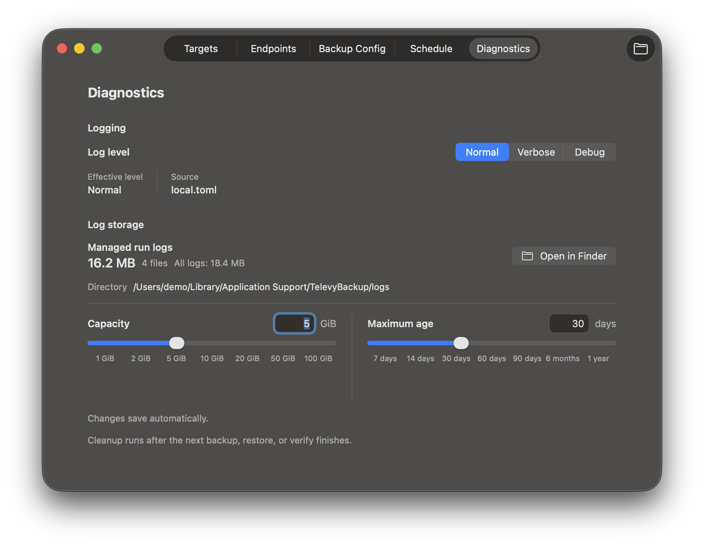
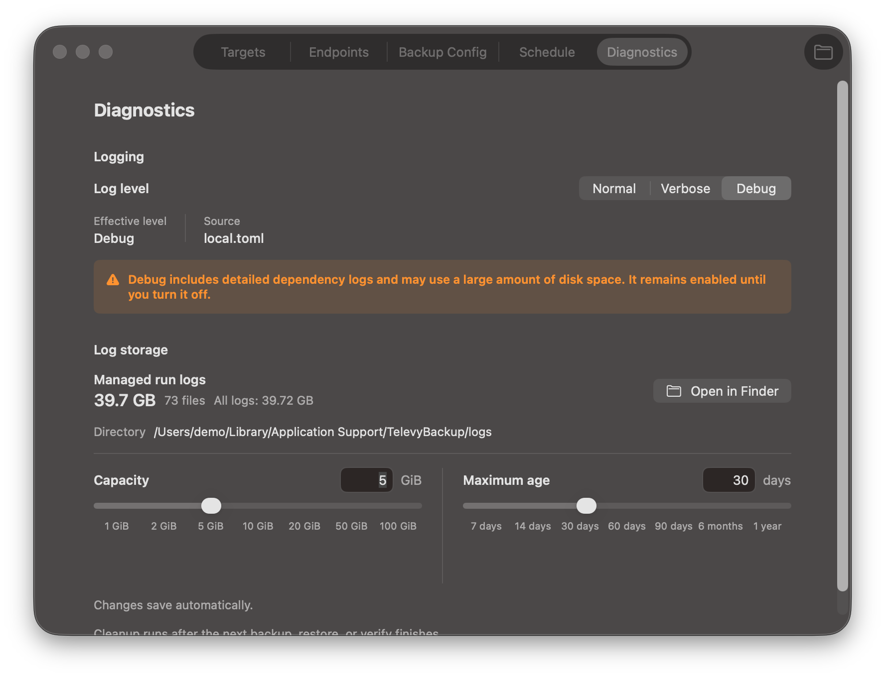
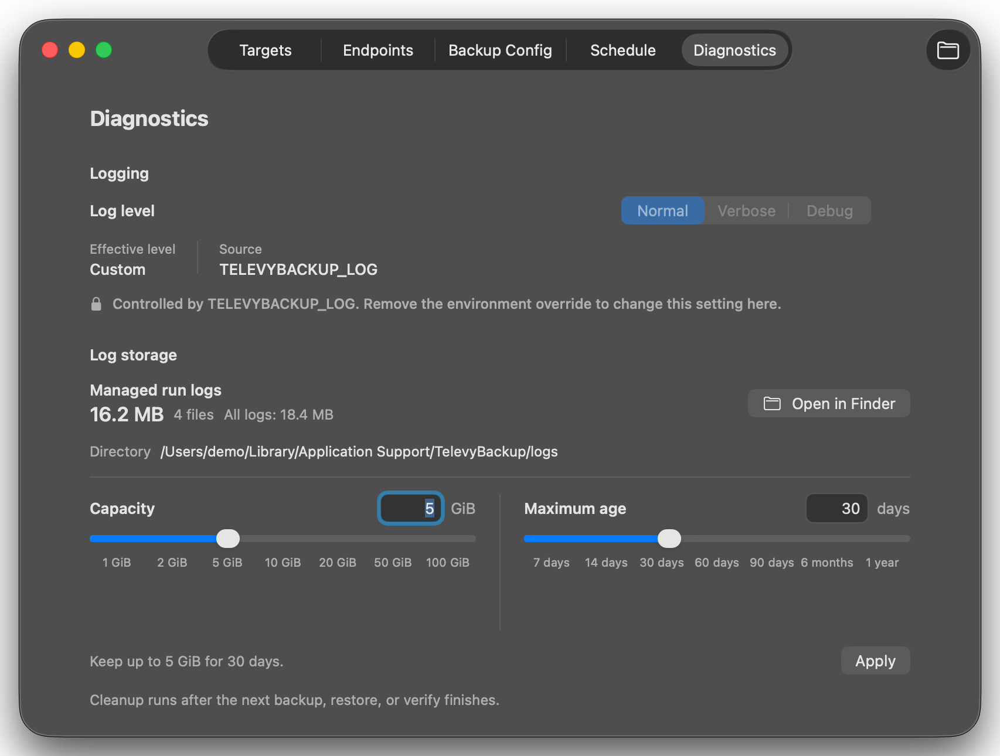
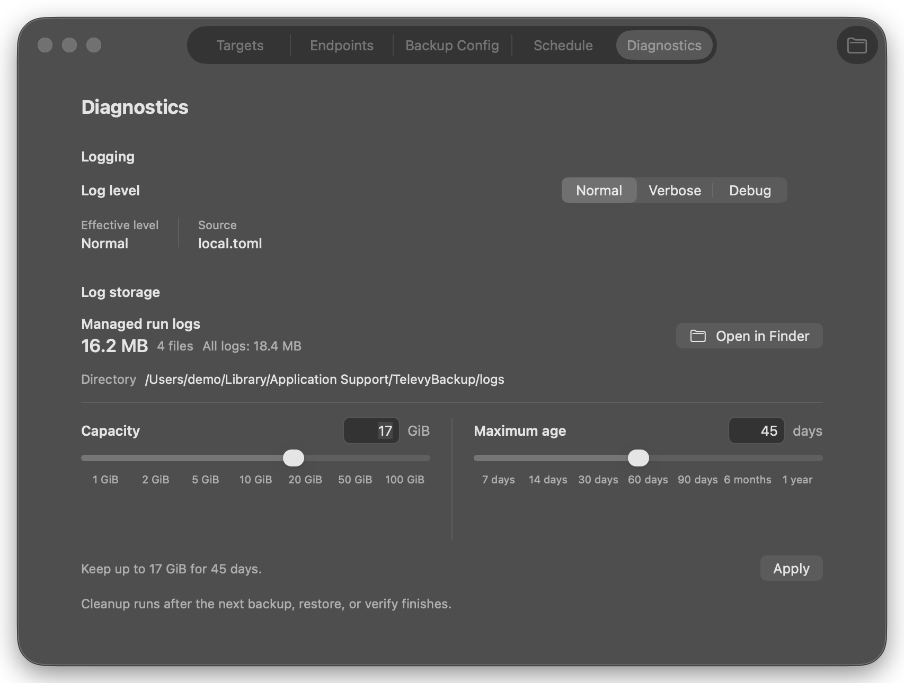

# Sync Logging Durability and Local Diagnostics (#0003)

## Background

Each backup, restore, and verify run writes a standalone NDJSON log. The original
default enabled global debug logging, which also persisted every SQLx query and
allowed normal installations to accumulate tens of gigabytes of logs.

The logging system must remain useful for diagnosis without making dependency
debug output the default. Users must be able to select the intended verbosity
from the macOS app and see when an environment variable overrides that choice.

## Goals

- Keep one parseable NDJSON file per run and flush plus fsync it before return.
- Default existing and new installations to a safe `Normal` preset.
- Persist a machine-local `Normal`, `Verbose`, or `Debug` preference outside the
  portable backup configuration.
- Apply a changed preference to the next run without restarting the daemon.
- Preserve advanced environment-filter overrides and expose their effective
  source in the app.
- Bound retained completed run logs by both age and managed disk usage without
  touching active runs or non-run files.
- Emit compact, normal-level performance events that distinguish actual scan,
  upload, wait, and index work for post-run timeline analysis.
- Keep secrets and machine-readable CLI output out of run logs.

## Non-goals

- Compression or rotation of run logs, or any policy for `ui.log` and unknown
  files in the log directory.
- Immediate deletion when a retention setting is changed.
- Remote log collection or a general metrics/tracing platform.
- Including the local logging preference in Backup Config export/import.

## Requirements

### Run files

- Every `backup`, `restore`, and `verify` run creates a unique
  `sync-<kind>-<timestamp>-<run-id>.ndjson` file.
- Every line is a UTF-8 JSON object containing `timestamp`, `level`, `target`,
  and `fields`.
- Normal completion flushes and fsyncs the file. Abnormal termination remains
  best effort.
- Logging never writes secrets and never contaminates stdout/stderr protocol
  output.

### Local preference

- `<config-dir>/local.toml` uses schema version 1 and stores
  `[logging] level = "normal|verbose|debug"`.
- A missing or invalid local file resolves safely to `Normal` and reports the
  validation problem without enabling debug.
- Writes are validated and atomic.
- A logging-setting mutation never replaces malformed or unsupported local
  configuration with defaults.
- Backup Config serialization remains unchanged and excludes `local.toml`.
- `[logging.retention]` stores `max_total_gib` (`1..100`, default `5`) and
  `max_age_days` (`7..365`, default `30`). Missing fields use those defaults;
  invalid local retention disables pruning until the file is corrected.

### Filter resolution

Precedence is fixed:

1. `TELEVYBACKUP_LOG`
2. `RUST_LOG`
3. the local App preference
4. `Normal`

Preset filters are fixed:

- `Normal`: dependencies at `warn`; TelevyBackup targets at `info`.
- `Verbose`: dependencies at `info`; TelevyBackup targets at `debug`.
- `Debug`: global `debug`, including SQLx query events.

Invalid environment filters resolve to `Normal`, never global debug.

### Runtime behavior

- A run keeps one filter for its entire lifetime.
- A daemon preference change made during a run is reported as pending and is
  applied once the daemon is idle, before the next run starts.
- CLI one-shot runs resolve the same preference and environment precedence
  before creating their run log.
- After each `backup`, `restore`, or `verify` reaches a terminal `run.finish`,
  the process fsyncs its current log then prunes only eligible completed run
  logs. Age pruning runs first, followed by oldest-first total-size pruning.
  The current log and any file with an active shared lock are skipped; a failed
  prune is reported but never changes the task outcome.
- Before writing either local logging setting, the CLI checks a responsive
  daemon's `logging.status` capability. A daemon that lacks the additive
  retention fields is rejected as incompatible and must be restarted, avoiding
  a silent fallback when it encounters the new local TOML section.

### Performance events

- `performance.scan.start` and `performance.scan.finish` mark the scan
  coroutine lifecycle only. They must not be rendered as resource-occupancy
  bars. The finish event includes accumulated walk, metadata, timed SQLite,
  read-chunk, hashing, encryption, upload-queue-blocked, and unattributed
  milliseconds.
- `performance.scan.trace` is emitted before every scan finish, including a
  failed scan. Its
  `trace_json` is a versioned JSON payload indexed from the scan start and
  contains only measured `walk_us`, `metadata_us`, `read_chunk_us`, `hash_us`,
  `encrypt_us`, and `sqlite_us` activity. It uses one-second buckets for normal
  runs and coarsens long runs while retaining at most 4,096 buckets; the actual
  precision is declared by `resolution_ms`. Missing fields are zero. Gantt
  charts render only these measured slices; gaps are unmeasured, not inferred
  scan work or idle time.
- Each upload-queue admission emits correlated
  `performance.scan.queue_wait.start` and `.finish` events around the actual
  byte-permit and channel wait. They contain an opaque queue-wait identifier,
  object kind, duration, and result, without paths or payload content.
- Every direct, pack, index-part, and index-manifest upload attempt emits
  `performance.upload.start` and `performance.upload.finish` around the actual
  storage RPC, correlated by a direct/pack sequence or an index-upload sequence
  plus attempt number.
  Queue wait, rate-limit wait, retry backoff, payload bytes, worker, and result
  are recorded without paths, chunk hashes, object IDs, or progress ticks.
- `performance.index.compression.start` and `.finish` bound actual SQLite index
  compression. These events are logged at TelevyBackup `info` so `Normal`
  captures them without enabling dependency debug output.

### Diagnostics interfaces

- JSON CLI commands expose `diagnostics get` and
  `diagnostics set-log-level --level <normal|verbose|debug>`, plus
  `diagnostics set-log-retention --max-total-gib <1..100> --max-age-days <7..365>`.
- Diagnostic status includes configured and effective levels, the effective
  filter and source, the overriding variable when present, a pending level,
  log directory, and best-effort log byte count.
- Daemon control IPC exposes its actual runtime logging status.
- The macOS Settings window includes a `Diagnostics` section with the preset
  picker, actual effective state, log directory/size, and an Open Logs action.
- Settings also exposes log-retention capacity and age inputs with a non-linear
  slider. Valid changes save automatically after a short debounce; the level
  picker may be environment locked, but retention remains editable.
- Concurrent local logging-setting updates are serialized so changing the level
  or retention limits never replaces the other setting with a stale value.
- When an environment variable overrides the preference, the picker is disabled
  and the variable name is visible.
- Effective Debug displays a persistent disk-usage warning without a
  confirmation dialog and remains enabled until changed.

## Contracts

- [Logging configuration](contracts/config.md)
- [Per-run log files](contracts/file-formats.md)

## Acceptance Criteria

- With no environment variables or local file, SQLx debug events are absent and
  TelevyBackup info events are present.
- With Debug configured, SQLx debug events are present.
- Changing the preference during a run does not alter that file; the next run
  uses the new filter.
- Environment overrides are reflected by daemon status and disable the App
  picker.
- An invalid environment expression or local file cannot enable global debug.
- Backup Config export contains no local logging preference.
- All generated run-log lines remain valid NDJSON and run summaries remain
  visible under restrictive filters.
- Retention only deletes completed `sync-{backup,restore,verify}-*.ndjson`
  files, never `ui.log`, unknown files, the current run, or active files owned
  by another process.
- A deterministic backup records correlatable actual scan resource slices,
  upload-queue waits, upload RPCs, retry waits, and index-compression intervals
  under the Normal preset.

## Visual Evidence

PR: include

PR: include

PR: include

PR: include

The images come from deterministic, mock-only Settings `ui_demo` scenes and are
limited to the Settings window launched for the capture.

## References

- Legacy source retained pending delete approval:
  `docs/plan/0003:sync-logging-durability/`
