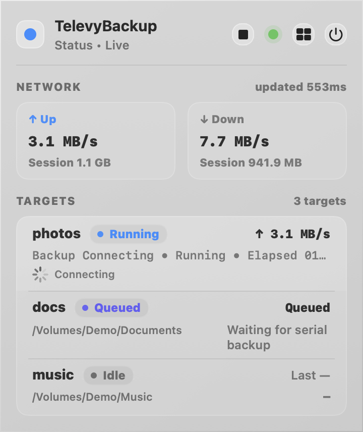
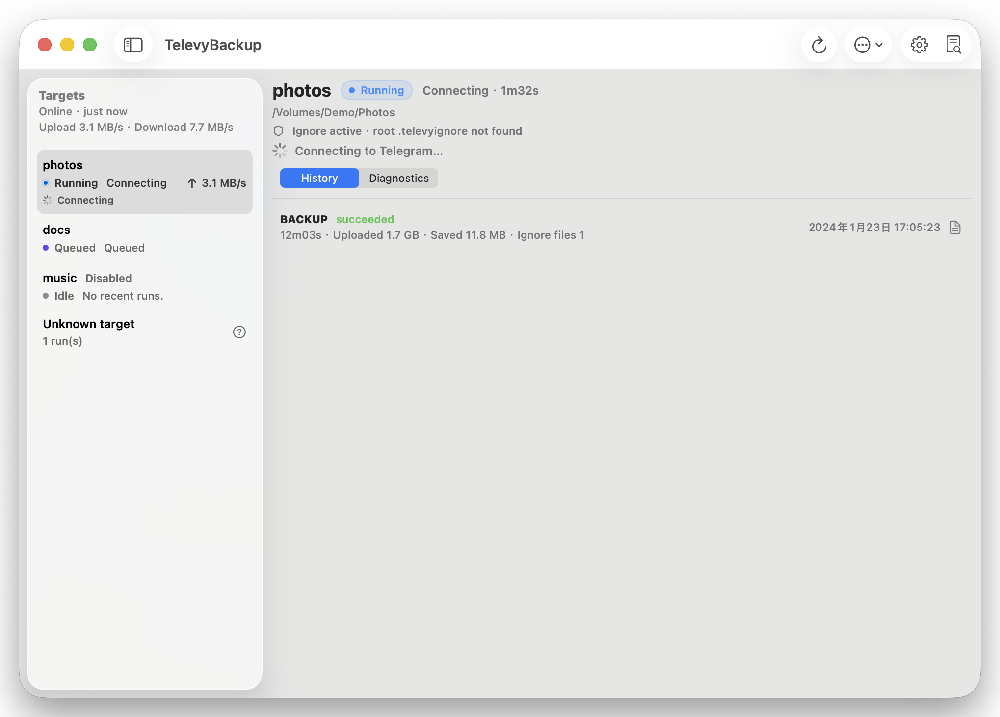
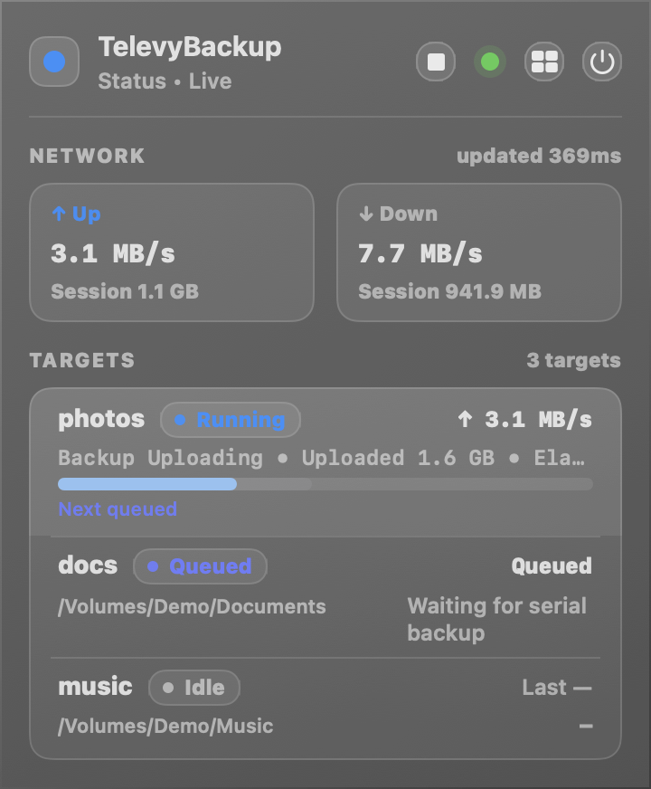
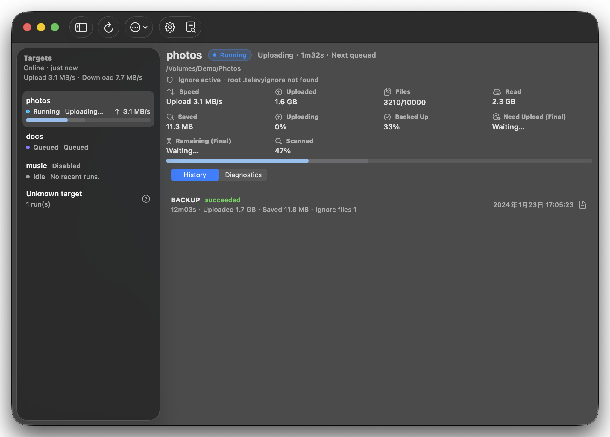

# 备份请求队列与前置阶段可观测性

> 当前有效规范以本文为准；实现覆盖与当前状态见 `./IMPLEMENTATION.md`，关键演进原因见 `./HISTORY.md`。

## 背景 / 问题陈述

App 曾通过 `control/backup-now` 文件请求 daemon 执行全量备份。daemon 轮询该文件，并在连接 Telegram 后才把目标标记为运行。因此点击后的前置等待会让所有目标持续显示 `Idle`，串行等待的目标也没有可观察状态。

本规范将手动备份收敛为 daemon 内单一的、非持久串行批次队列，并定义从请求发出到运行进度的状态投影。它消除文件触发、重复调度和 UI 盲等的歧义。

## 目标 / 非目标

### Goals

- 提供可确认、可合并的 `backup.enqueue` control RPC，作为所有 App 备份入口的唯一请求通道。
- 提供明确的 `backup.stop` control RPC，让 App 的主操作只表达开始或停止备份。
- 严格串行执行目标，并且最多保留活动批次和一个后续批次。
- 让队列成员、连接、准备和既有确定性进度阶段立即反映在 status snapshot 与 macOS UI。
- 保持 `z324m-unified-backup-progress-prepare` 的 Prepare 与 scan/upload/index 进度口径不变。

### Non-goals

- 不并行备份、预扫描后续目标、显示位置或 ETA，也不引入优先级。
- 不支持多个累计后续批次或 daemon 重启后的队列恢复。
- 不改变 CLI `backup run` 的独立直跑语义、备份算法、限速、索引、restore 或 verify 语义。
- 不保留文件触发或混版本 App/daemon 兼容路径。

## 范围（Scope）

### In scope

- core control/status 协议、daemon 队列协调与 CLI enqueue/stop 薄封装。
- Popover 和 Main Window 的 `Starting` 本地桥接、队列/阶段投影和状态按钮。
- 确定性 UI demo 场景、Swift/Rust 自动化测试和亮暗色视觉证据。

### Out of scope

- 队列持久化、恢复、取消、优先级、ETA 或非备份工作流。
- Liquid Glass 视觉体系重做。

## 需求（Requirements）

### MUST

- `backup.enqueue` 只接受互斥 scope：`allEnabled` 或 `targets(targetIds)`；返回 opaque batch id、`accepted|coalesced` disposition 与最终 target ids。
- `allEnabled` 在接收时冻结已启用目标；`targets` 可请求已禁用目标。未知目标、空集合、主密钥或全局 Telegram API 凭据缺失必须立即以结构化错误拒绝。
- daemon 同时只执行一个目标。空闲批次尚未启动时的请求合并进活动批次；运行期间的请求按配置顺序去重合并进唯一后续批次。
- 目标在连接 Telegram 前就必须建立 run/task 并发布 `state=running, phase=connecting`；连接后进入 `Preparing`，其余进度沿用 `z324m`。
- status snapshot 在不改变 `TargetState.state` 既有值集合的前提下，additive 暴露目标的活动/后续批次成员关系。
- App 点击即将受影响目标投影为 `Starting`；RPC 成功后等待带相同 batch id 的 daemon snapshot 接管，RPC 失败或超时立即撤销并显示可恢复错误。
- 主操作按钮仅使用开始或停止语义：空闲显示 Start backup，队列或运行中显示 Stop backup，短暂请求期间显示对应的 progress indicator 并禁用。
- `backup.stop` 必须取消当前 daemon 备份任务并清空活动/后续手动批次，但不得停止 daemon 或改变定时备份设置。
- 等待成员显示 `Queued`；运行目标若同时属于后续批次，显示 `Next queued`。不得显示位置或 ETA。

### SHOULD

- 单目标 endpoint、目录或连接失败只记录该目标失败，并继续后续队列成员。
- 队列存在时 status IPC 使用活动刷新频率。
- Popover、Main Window 列表和详情共享同一状态/阶段映射及 VoiceOver 文案。

### COULD

- UI demo 在一个场景中同时展示 Connecting + Queued，另一个场景展示 Running + Next queued。

## 功能与行为规格（Functional/Behavior Spec）

### Core flows

1. App 对全量或单目标请求立即显示 `Starting`，调用 CLI 的 enqueue 薄封装。
2. control IPC 校验请求、配置、vault 与全局 API 凭据，创建或合并 batch，并同步更新目标 queue membership。
3. daemon 取出活动批次的下一个目标；在 Telegram connect 前创建运行状态并发布 `connecting`。
4. 目标完成或失败后移除其活动成员关系，继续同一批次的下一个目标；批次结束后原子提升唯一后续批次。
5. UI 由匹配 batch id 的 snapshot 接管本地桥接。运行成员展示 Connecting、Preparing 或既有 progress；其他成员展示 Queued。
6. App 在队列或运行中请求 `backup.stop`；daemon 取消当前任务、清空手动队列，并在取消完成后让 UI 回到 Start backup。

### Edge cases / errors

- 重复请求不得创建第三个批次，也不得造成并发执行。
- 单目标请求若目标已不存在，保持批次其他目标继续执行，并把该目标记录为失败。
- RPC 的范围校验、无可运行目标和全局准入失败必须返回稳定的机器可读 code；UI 显示可理解的错误摘要。
- daemon 退出丢弃未开始队列；没有恢复承诺。

## 接口契约（Interfaces & Contracts）

### 接口清单（Inventory）

| 接口（Name） | 类型（Kind） | 范围（Scope） | 变更（Change） | 契约文档（Contract Doc） | 负责人（Owner） | 使用方（Consumers） | 备注（Notes） |
| --- | --- | --- | --- | --- | --- | --- | --- |
| `backup.enqueue` | control RPC | internal | New | `./contracts/control-status-ipc.md` | daemon | CLI, macOS App | single writer queue admission |
| `backup.stop` | control RPC | internal | New | `./contracts/control-status-ipc.md` | daemon | CLI, macOS App | cancel current daemon task and clear manual batches |
| `backupQueue` | status snapshot | internal | Modify | `./contracts/control-status-ipc.md` | daemon/core | CLI, macOS App | additive target membership |
| `backup enqueue` | CLI command | internal | New | `./contracts/control-status-ipc.md` | CLI | macOS App | thin control IPC client |
| `backup stop` | CLI command | internal | New | `./contracts/control-status-ipc.md` | CLI | macOS App | thin control IPC client |

### 契约文档（按 Kind 拆分）

- [`./contracts/control-status-ipc.md`](./contracts/control-status-ipc.md)

## 验收标准（Acceptance Criteria）

- Given idle daemon, When all-enabled 或单目标请求有效，Then RPC 返回 batch id 且每一时刻最多一个目标运行。
- Given active batch, When 再次请求，Then 新成员按配置顺序合并到尚未开始活动批次或唯一后续批次。
- Given a target needs Telegram connection, When batch starts it, Then status 先呈现 `connecting`，后续目标呈现 `Queued`。
- Given queue and UI request bridge, When RPC succeeds or fails, Then UI 分别由同 batch daemon snapshot 接管或立即移除 Starting。
- Given a queued or running daemon backup, When the primary action is pressed, Then it shows Stop backup, requests `backup.stop`, and returns to Start backup after cancellation rather than queuing another batch.
- Given dark/light demo scenes, When capture Popover and Main Window, Then Connecting/Queued and Running/Next queued are清晰、无重叠且按钮状态可辨。

## 验收清单（Acceptance checklist）

- [x] 核心路径的长期行为已被明确描述。
- [x] 关键边界/错误场景已被覆盖。
- [x] 涉及的接口/契约已写清楚。
- [x] 相关验收条件已经可以用于实现与 review 对齐。

## 非功能性验收 / 质量门槛（Quality Gates）

### Testing

- Rust：`backup.enqueue` / `backup.stop` 契约、批次合并/串行/失败推进、文件路径移除。
- Swift：TargetPresentation、StatusStore、BackupRequestPresentation 的桥接和开始/停止按钮状态。
- Full: `cargo fmt --all -- --check`, `cargo clippy --all-targets --all-features -- -D warnings`, `cargo test --all-features`, `scripts/macos/swift-unit-tests.sh`, `scripts/macos/build-app.sh`。

### UI / Storybook (if applicable)

- 使用 `ui_demo` 的 Popover/Main Window 亮暗色快照；不适用 Storybook。

## Visual Evidence

PR: include

PR: include

PR: include

PR: include

这些图片由 `scripts/macos/capture-backup-queue-ui.sh` 的独立 demo 实例生成，范围仅为 Popover 与 Main Window；主窗口捕获按 launch PID 绑定并拒绝全屏回退。

## Related PRs

- None

## 风险 / 开放问题 / 假设（Risks, Open Questions, Assumptions）

- 风险：daemon 是队列唯一写入者；任何绕过 control IPC 的 App 入口会重新引入状态分裂。
- 风险：status snapshot 的 queue 字段必须 additive，以保持旧解码端兼容。
- 需要决策的问题：None。
- 假设：App、CLI 与 daemon 作为同一发行物同步升级。

## 参考（References）

- `../z324m-unified-backup-progress-prepare/SPEC.md`
- `./IMPLEMENTATION.md`
- `./HISTORY.md`
