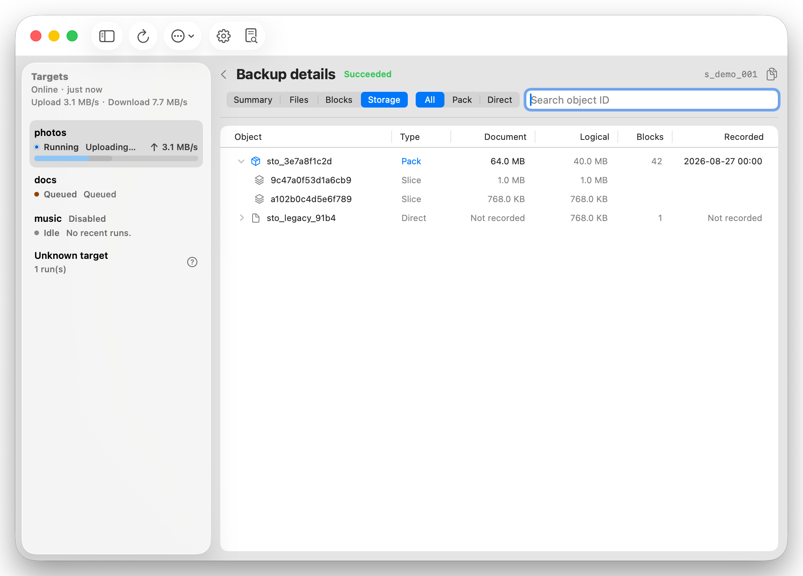
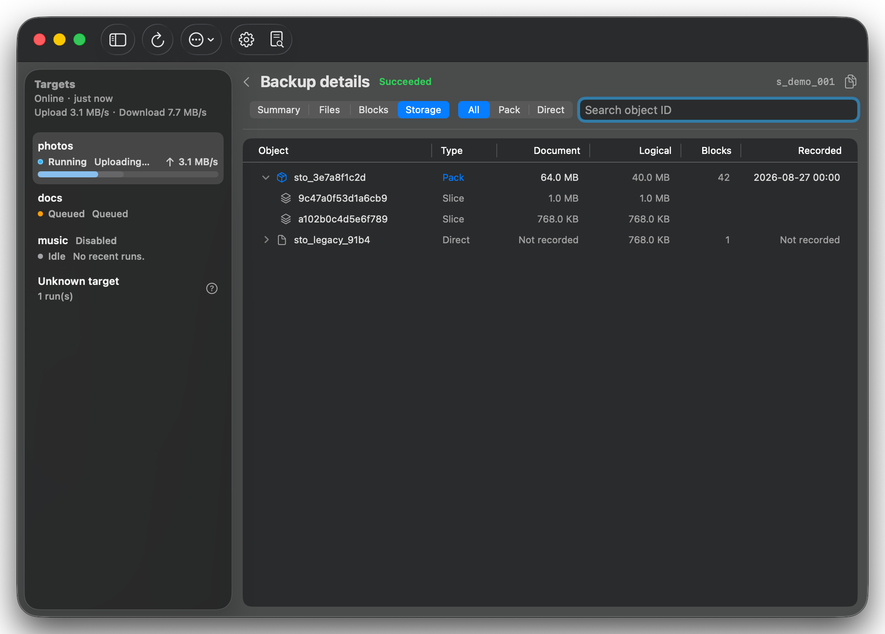
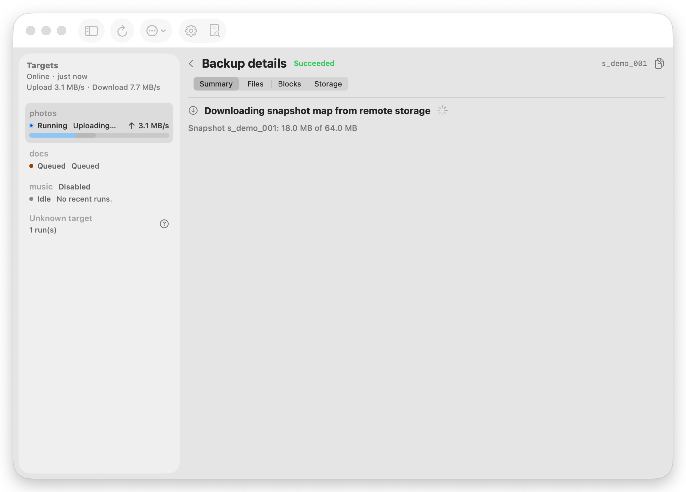
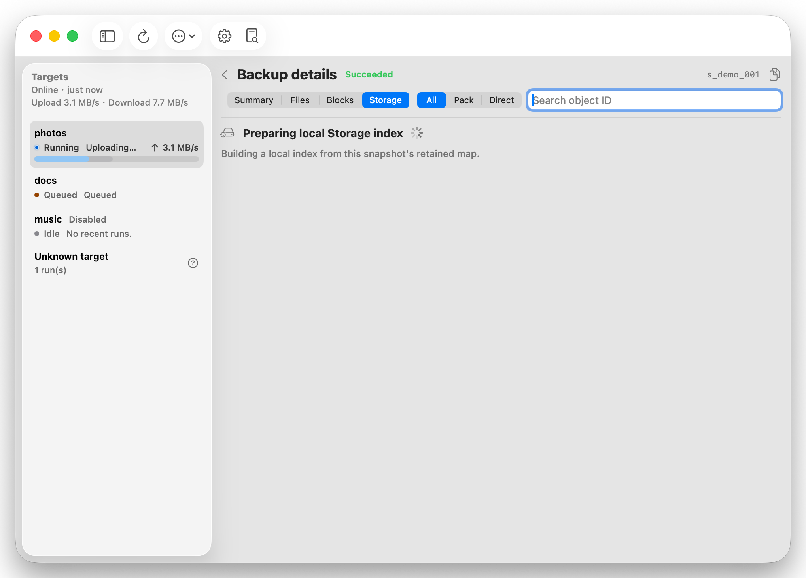
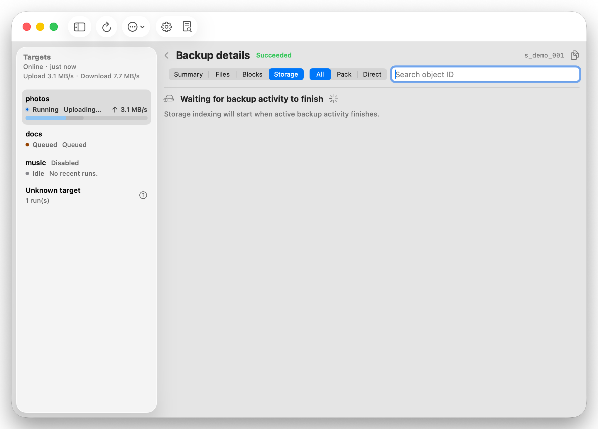

# Backup Snapshot Inspection

> Canonical topic retained as the canonical source for current product behavior.

> Current requirements are defined here. Implementation coverage is recorded in `./IMPLEMENTATION.md`, topic-local compatibility and background in `./HISTORY.md`, and durable rationale in the related ADR.

## Context and Scope

The Main Window groups run-log summaries by target, but a row cannot currently answer which files a successful backup captured, how its file tree differs from the backup's direct baseline, or which logical backup blocks it references. Run logs alone cannot provide that evidence; the snapshot filemap is the authority.

### Goals

- Let an operator open a backup run from target history and inspect its result without leaving the Main Window.
- Show a successful retained snapshot's summary, file list, direct-baseline file-tree changes, and deduplicated logical backup blocks.
- Show the selected snapshot's referenced physical Telegram data documents as grouped `Pack` and `Direct` objects, using only local index metadata.
- Persist the exact uploaded document payload size and record time for new physical objects while keeping legacy metadata explicitly unknown.
- Keep large snapshot inspection responsive through background paging, lazy tree expansion, search, and virtualized rows.
- Preserve the existing macOS native, dense, light/dark adaptive visual language.

### Non-goals

- File-content, text, binary, or side-by-side diffs.
- Move or rename detection; a path change remains a deletion plus an addition.
- Listing ignored paths, Telegram messages, or system metadata documents (manifests, index parts, or dedupe catalog objects).
- Querying Telegram for an object inventory, document status, message metadata, or missing legacy size/time values.
- Changing snapshot retention, restoring a selected historical snapshot, or retaining an independent permanent full-file history.

### Scope

#### In scope

- A run-detail route inside the Main Window, entered by activating a history row and exited through native back navigation.
- A read-only snapshot inspector exposed through the CLI's JSON contract for terminal users and through daemon control IPC for the macOS App.
- On-demand loading of a retained snapshot filemap, with compatibility for current two-level indexes and legacy single-index snapshots.
- Tree and list presentations, a changes-only filter, and a logical-block presentation.
- A lazy Storage presentation with Pack/Direct filtering, opaque-ID search, bounded paging, and row expansion to snapshot-referenced block slices.
- Explicit loading, empty, unavailable, and error states.

#### Out of scope

- Changing the backup scanner, chunking, index format, remote retention, or run-log retention.
- Direct macOS App reads of endpoint/filemap SQLite databases.
- A new window, modal inspector, or a visual-system redesign.

## Related ADRs

- [0001-snapshot-inspection-retention](../../adr/0001-snapshot-inspection-retention.md)
- [0005-offline-storage-object-inspection](../../adr/0005-offline-storage-object-inspection.md)
- [0006-snapshot-storage-inspection-sidecar](../../adr/0006-snapshot-storage-inspection-sidecar.md)

## Requirements

### MUST

- `REQ-SI-001`: A history row for any run opens a detail page. Failed, cancelled, and running backups show run summary and available error/log information but must not show fabricated file or block data.
- `REQ-SI-002`: A successful backup with a retained snapshot shows `Summary`, `Files`, `Blocks`, and `Storage` views. Summary is the default view; Files defaults to tree presentation with changes-only enabled.
- `REQ-SI-003`: The Files view supports a tree and a flat list presentation, path search, and an all-files/changes-only switch. The selected presentation and filter remain stable while the detail page is open.
- `REQ-SI-004`: Changes compare only the snapshot's `base_snapshot_id`. A first snapshot marks every stored entry as added. If the direct baseline is unavailable, the snapshot remains browseable but changes-only is disabled with an explanatory state.
- `REQ-SI-005`: Changes are exactly `added`, `deleted`, or `changed`. A regular file is changed when its kind, size, modification time, or mode differs. A directory or symlink can only be compared by presence or kind. No move state is emitted.
- `REQ-SI-006`: A changes-only tree contains the ancestor directories needed to reach a changed entry and provides per-directory added/deleted/changed totals. A changes-only list contains only direct change entries.
- `REQ-SI-007`: Deleted entries are displayed at their baseline path with baseline metadata. Changed entries expose current and baseline metadata without exposing file contents.
- `REQ-SI-008`: The Blocks view lists distinct logical blocks referenced by regular files in the snapshot, with hash, size, changed-file count, and total referencing-file count. It provides a `Changes only` filter for blocks with at least one added or changed current file reference. It does not classify a block as newly uploaded or reused in the run.
- `REQ-SI-009`: The inspector loads data outside the main thread and presents visible loading or retryable error feedback. It must use bounded, cursor-based data access and virtualized UI rows rather than materializing a whole snapshot in SwiftUI.
- `REQ-SI-010`: File paths, block hashes, and filemap contents stay local to the configured storage/cache path and must not be written to normal run logs or status snapshots.
- `REQ-SI-011`: Storage rows expose only a stable opaque storage ID, `pack|direct` kind, optional recorded document size/time, reference counts, and logical bytes. Raw Telegram chat, message, and document locator fields are never returned.
- `REQ-SI-012`: Storage object grouping is derived only from the selected snapshot's ordinary file block mappings. A missing legacy `storage_objects` row returns unknown physical size/time and is never inferred from logical or slice bytes.
- `REQ-SI-013`: Storage paging and object expansion read a complete local, snapshot-scoped sidecar index. They must not materialize all selected-snapshot mappings, all catalog metadata, or all object slices at request time.
- `REQ-SI-014`: A new snapshot schedules local Storage-sidecar preparation after its successful backup; an older missing sidecar is prepared after Storage is selected. The service returns a typed preparing, retrying, or failed state without partial rows, defers preparation while backup activity is active, and atomically publishes a complete sidecar before it becomes queryable.
- `REQ-SI-015`: A retained snapshot filemap remains automatically materialized on demand. The App must distinguish local checking, remote snapshot-map download, verification, decompression, cache writing, and Storage-index preparation; it must never present these preparation phases as snapshot expiry or unavailability.
- `REQ-SI-016`: The Storage sidecar is local-only at `index/storage-inspection/<endpoint-id>/<snapshot-id>.sqlite`, contains opaque object IDs and block/slice membership only, and is deleted with its retained snapshot. It is neither uploaded nor synchronized and must not persist Telegram locator fields.

### SHOULD

- Summary combines the run-log fields already available to the App (outcome, start/end, duration, transfer bytes, deduped bytes, error) with snapshot-derived counts, direct-baseline availability, source path, and snapshot ID.
- Summary exposes copy actions for the snapshot ID and an action to reveal the run log.
- File rows use a consistent SF Symbol, a visible status label, and semantic state color so color alone never communicates the change type.
- All table/tree controls are keyboard reachable and their selected state, loading state, and unavailable state are available to VoiceOver.

### COULD

- A block selection can later reveal the files referencing that block through a separate paged query.
- A Storage object selection reveals its selected-snapshot block slices through a separate paged query.

## Functional Behavior

### Core flows

1. The App activates a target-scoped run-history row and navigates the detail pane to that run.
2. The App immediately renders run-log information. For an eligible successful run, it requests snapshot summary in the background.
3. The inspector resolves the snapshot from the retained endpoint index and opens its local filemap, downloading TelevyBackup's encrypted snapshot map through the existing index resolver only when it is absent locally. The App starts or joins this shared preparation work and displays the remote-storage download stage honestly.
4. Summary returns snapshot totals and direct-baseline availability. Files and Blocks fetch bounded pages only after their view is selected.
5. Files in tree mode request direct children as folders expand. List mode requests a flat cursor page. Changes-only requests change rows and required ancestor context.
6. Storage requests a bounded object page only after its tab is selected. A missing sidecar starts one snapshot-scoped background build and returns an explicit non-ready state until its atomic publication. Filters and opaque-ID search reset the cursor. Expanding a row requests only that object's selected-snapshot block slices.
7. The App renders result rows through a virtualized table/tree surface and cancels or discards obsolete page work when the user changes run, presentation, query, or filter.

### Edge cases and errors

- A run without `snapshot_id`, a failed/cancelled run, or an expired snapshot presents the summary state only; it never substitutes a current/latest snapshot.
- A retained first snapshot has no baseline and reports all entries as added rather than `baseline unavailable`.
- A retained snapshot whose direct baseline is no longer retained offers all-files browsing but no calculated difference view.
- Missing, corrupted, undecryptable, or unreachable filemaps show a retryable inspection error without changing backup/restore state.
- Empty snapshots, empty block sets, and snapshots with no direct changes have distinct empty states.
- A snapshot containing only legacy object mappings shows a coherent `not recorded` physical-size/time state; it does not substitute logical bytes.
- A missing filemap and a missing Storage sidecar are independent conditions. Filemap preparation can require a remote download; Storage sidecar preparation only reads local snapshot and endpoint/dedupe indexes after the filemap is ready.
- Interrupted, incompatible, or failed Storage sidecars are discarded and rebuilt as a new temporary file. No partial sidecar is inspected.
- A row with legacy/missing target identity remains in the existing Unknown target grouping; it must not be reassigned by the inspector.

## Interfaces and Contracts

### Inventory

| Interface | Kind | Scope | Change | Contract | Owner | Consumers | Notes |
| --- | --- | --- | --- | --- | --- | --- | --- |
| `snapshots inspect` | CLI JSON | internal | New | [CLI contract](./contracts/cli.md) | CLI/core | terminal users | Read-only paged snapshot inspector |
| `snapshot.inspect.summary/files/blocks` | daemon control IPC | internal | New | This specification | daemon/core | macOS App | Read-only JSON requests over the existing local authenticated control socket |
| `snapshot.inspect.storage/storage-blocks` | daemon control IPC | internal | New | This specification | daemon/core | macOS App | Snapshot-scoped physical object pages |
| `snapshot.inspect.prepare` | daemon control IPC | internal | New | This specification | daemon/core | macOS App | Shared snapshot-map preparation operation with sanitized progress |
| Snapshot filemap resolver | Core API | internal | Modify | [CLI contract](./contracts/cli.md) | core | CLI, daemon | Reuses retained-snapshot materialization semantics |
| Run detail route and views | Swift API | internal | New | This specification | macOS App | Main Window | Summary, Files, Blocks, Storage |

### Contract documents

- [CLI contract](./contracts/cli.md)

## Acceptance Criteria

- Given a successful retained backup run in a target history, when its row is activated, then the Main Window navigates to its summary and offers Files and Blocks without opening a modal or separate window.
- Given a first successful snapshot, when changes-only Files is opened, then every stored file-tree entry is marked added and no baseline error is shown.
- Given a retained snapshot with added, deleted, and modified regular files, when Files is opened in tree or list presentation, then both presentations return the same direct-baseline change classification; a deleted entry remains at its former path and no move marker appears.
- Given a directory with one changed descendant, when changes-only tree mode is opened, then its ancestor directories are visible with aggregate change counts while unchanged sibling branches are absent.
- Given a snapshot whose baseline was pruned, when the run detail is opened, then all-files browsing remains available, changes-only is disabled with an explanation, and no other snapshot is used as a substitute.
- Given an expired snapshot or a failed/cancelled backup run, when its row is activated, then the App shows the execution summary and unavailable reason but does not request or display a file/block list.
- Given a snapshot containing more files or blocks than a page, when the operator scrolls, searches, expands a node, or changes view, then rows are loaded incrementally and stale work cannot overwrite the current selection.
- Given a changes-only detail that has loaded its summary, when the operator expands another directory, then the App requests the already-running daemon over its local control socket and the daemon reuses the prepared direct-baseline index rather than launching a CLI process or repeating the full comparison.
- Given a block referenced by multiple files, when Blocks is opened, then one logical block row reports the aggregate reference count rather than multiple upload-attempt rows.
- Given a block referenced by changed and unchanged files, when Blocks is opened, then the row reports separate changed-file and total referencing-file counts; when `Changes only` is enabled, unchanged-only block rows are omitted.
- Given a Blocks page request is still pending when the filter changes, then the stale response is discarded and cannot append rows from the previous filter mode.
- Given a legacy single-index snapshot or a current two-level snapshot, when it is retained and its filemap is available, then the inspector uses the same restored file-tree semantics as restore/verify.
- Given a retained snapshot with direct and pack mappings, when Storage is opened, then one row is returned per referenced physical object, pack slices are grouped into one `Pack` row, and direct objects remain separate.
- Given a newly uploaded physical object, when its mapping is persisted, then Storage reports its exact uploaded document bytes and record time; given a legacy mapping without an object record, then both fields are unavailable and no remote request is made.
- Given a Storage object page or expansion request, when its snapshot, filter, query, object ID, or limit differs from the cursor context, then the cursor is rejected as invalid and no raw Telegram identifier is returned.

## Verification

- `VER-SI-001`: Core tests cover retained snapshots, baseline semantics, block aggregation, cursor binding, physical-object persistence, Storage grouping, legacy unknown metadata, materialized dedupe mappings, atomic sidecar publication, and sidecar SQL paging; covers: REQ-SI-001, REQ-SI-004, REQ-SI-005, REQ-SI-006, REQ-SI-007, REQ-SI-008, REQ-SI-009, REQ-SI-010, REQ-SI-012, REQ-SI-013, REQ-SI-014, REQ-SI-016.
- `VER-SI-002`: CLI JSON and daemon IPC tests cover paged `storage` and `storage-blocks` responses, opaque-only IDs, filter/query/limit-bound cursors, selected-snapshot block expansion, non-ready Storage states, and sanitized snapshot-map preparation progress; covers: REQ-SI-002, REQ-SI-009, REQ-SI-011, REQ-SI-012, REQ-SI-013, REQ-SI-014, REQ-SI-015.
- `VER-SI-003`: Swift presentation tests and deterministic Main Window light/dark demos cover lazy loading, filter/search reset, expansion, remote-download and sidecar-preparing states, loading/error/empty/legacy states, and distinct Document versus Logical columns; covers: REQ-SI-001, REQ-SI-002, REQ-SI-003, REQ-SI-009, REQ-SI-011, REQ-SI-012, REQ-SI-014, REQ-SI-015.
- `VER-SI-004`: Formatting, clippy, workspace all-features tests, macOS unit tests, app build, and the Storage query performance fixture must pass before delivery; covers: REQ-SI-009, REQ-SI-010, REQ-SI-013.

## Visual Evidence

Deterministic light and dark Main Window Storage demos are required owner-facing evidence for this capability. They must include a recorded object, a legacy `Not recorded` object, distinct Document and Logical columns, and an expanded pack slice without Telegram locator fields. Separate deterministic states must show a remote snapshot-map download and local Storage-index preparation.

## References

- [Two-level endpoint and snapshot indexes](../endpoint-two-level-index/SPEC.md)
- [Index tiering and historical filemap availability](../index-tiered-filemaps/SPEC.md)
- [Run-log durability](../sync-logging-durability/SPEC.md)
- [Topic implementation status](./IMPLEMENTATION.md)
- [Topic history](./HISTORY.md)
