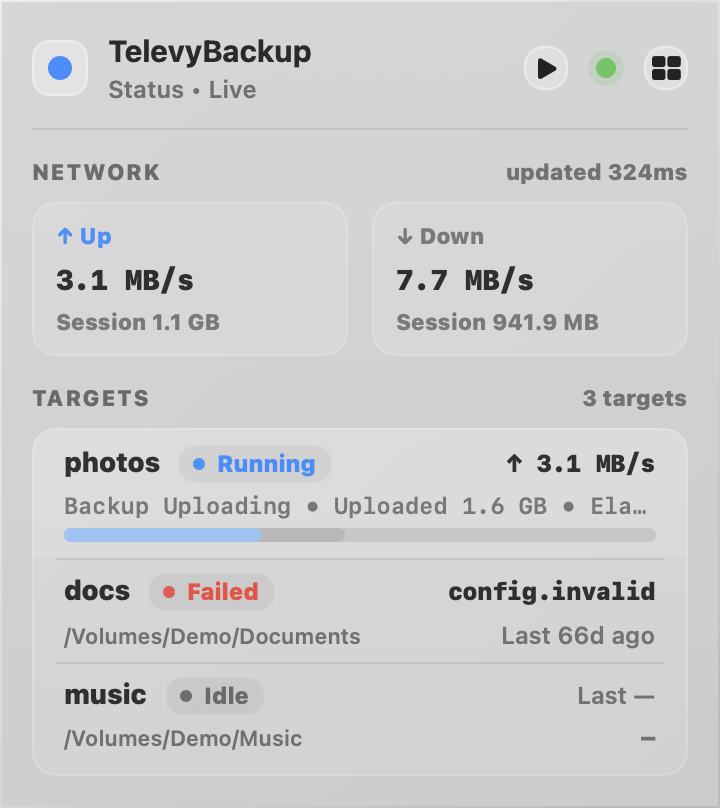
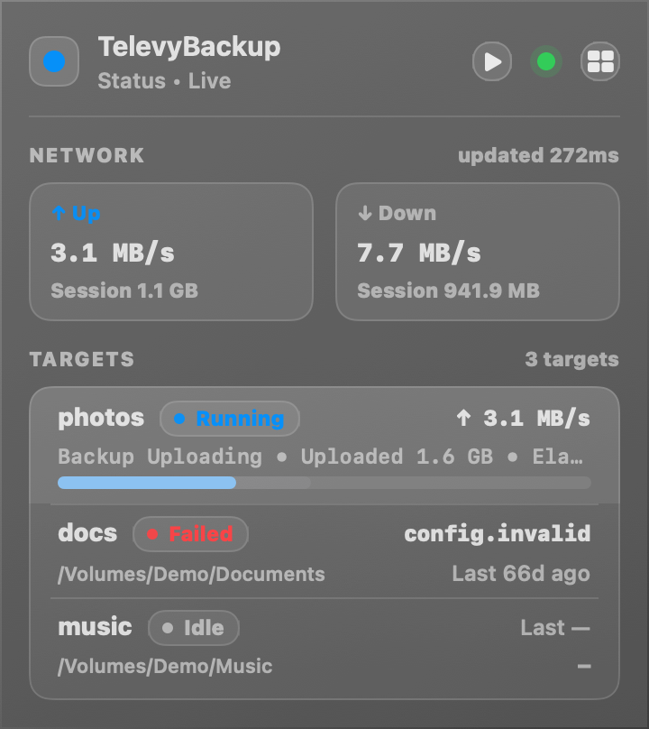
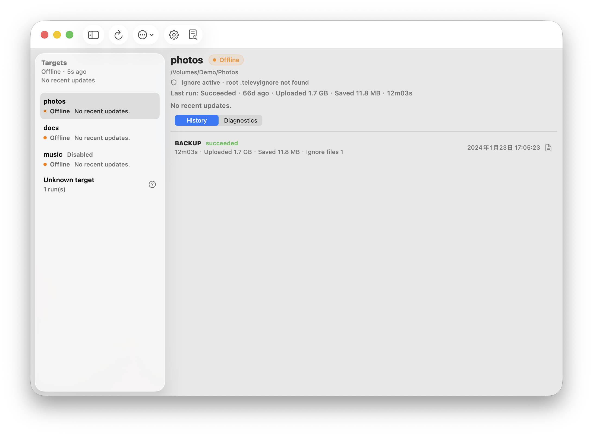
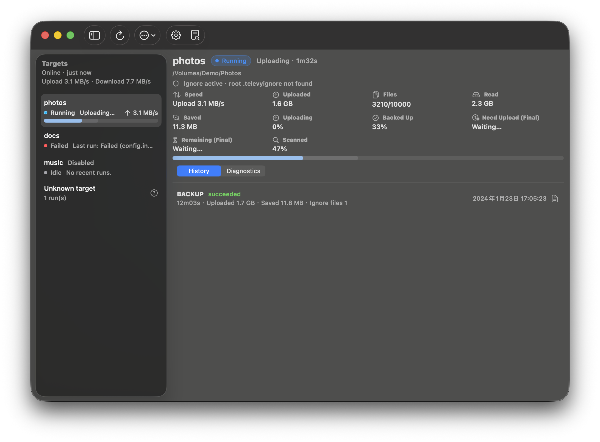
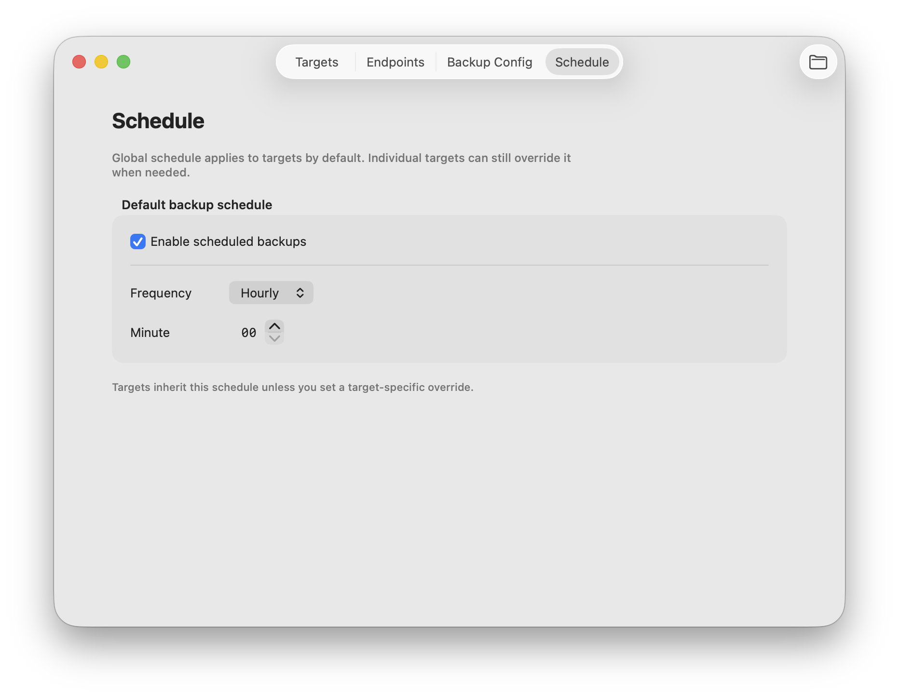
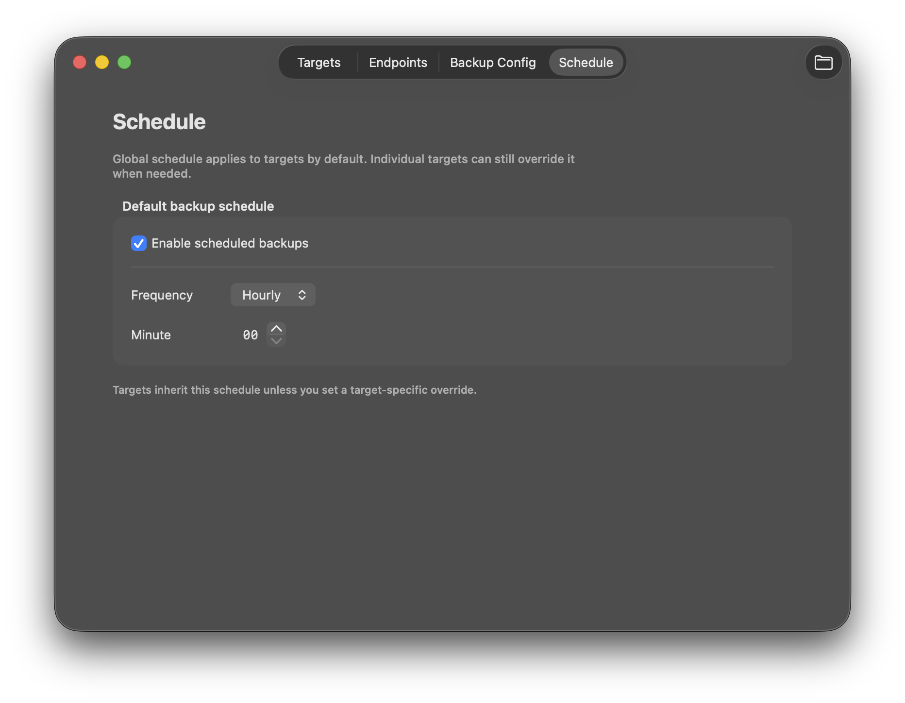
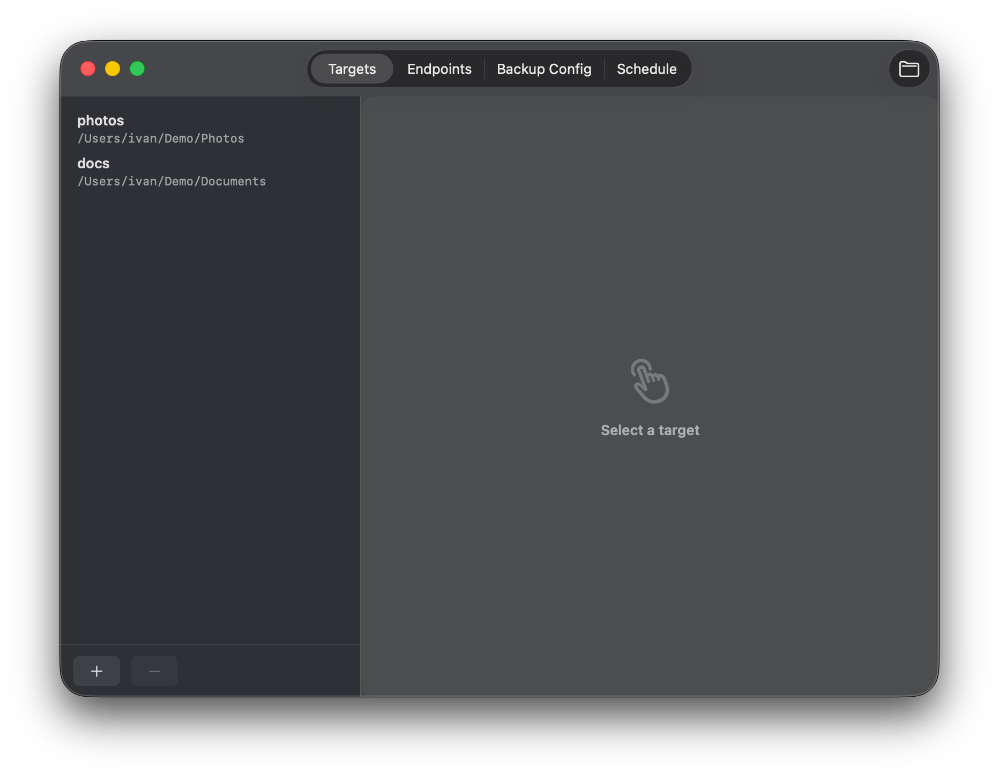
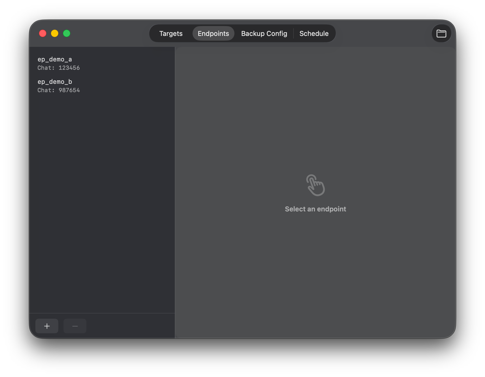
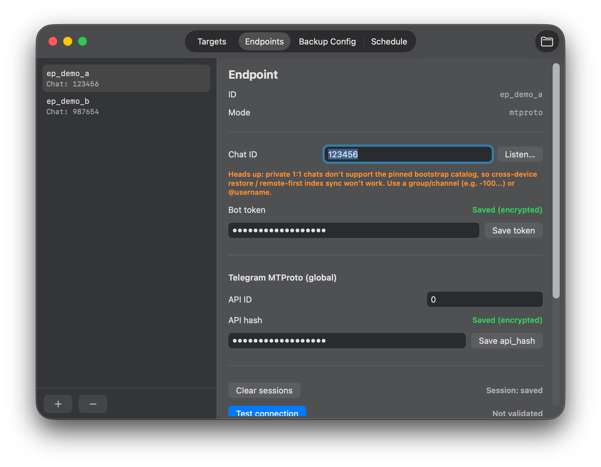
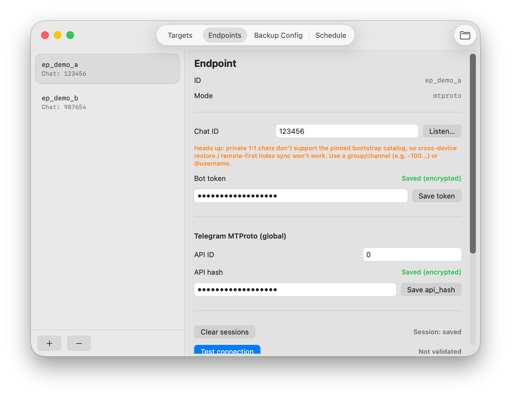

# macOS 明暗主题支持与系统自动切换（#fdwoo）

## 状态

- Status: 已完成
- Created: 2026-04-08
- Last: 2026-04-09
- Notes: 主题实现与系统跟随已完成；2026-04-09 继续修复 Settings 左侧 sidebar 在暗色模式下回落成纯黑背景的回归，并补充真实窗口视觉证据。

## 背景 / 问题陈述

- 当前 macOS UI 仍被强制锁定为浅色：`NSAppearance(.vibrantLight)` 与 `.preferredColorScheme(.light)` 会覆盖系统外观。
- Popover 里仍有大量固定浅色玻璃/描边/分隔线 token，在深色模式下会出现明显残留。
- 主窗口虽然主要依赖系统语义色，但少量固定白/黑装饰在暗色下对比不稳定。

## 目标 / 非目标

### Goals

- 支持 macOS 浅色 / 深色主题，并默认跟随系统外观自动切换。
- 新增内部主题桥接层：`AppAppearanceOverride` 与 `PopoverTheme`。
- 提供仅用于测试 / 截图的 `TELEVYBACKUP_UI_APPEARANCE=system|light|dark`。
- 让 Popover、Main Window、Settings Window 在浅色/深色下都具备可接受的对比度与一致性。
- 补齐可重复的主题截图路径，并把最终证据写入本 spec。

### Non-goals

- 不新增用户可见的主题设置项。
- 不修改 Rust/CLI/daemon/schema/config 持久化。
- 不重做整体视觉风格，只修复主题适配与可读性问题。

## 范围（Scope）

### In scope

- `macos/TelevyBackupApp/Appearance.swift`
  - 新增外观 override 解析、AppKit 外观应用辅助、Popover 主题 token。
- `macos/TelevyBackupApp/TelevyBackupApp.swift`
  - 移除强制浅色逻辑；让 popover/main/settings 继承系统 appearance；按 theme token 改造 popover 相关配色。
- `macos/TelevyBackupApp/MainWindow.swift`
  - 修正暗色下选中态 / 状态徽章可读性。
- `macos/TelevyBackupApp/UISnapshot.swift`
  - 支持主题截图命名与动态背景解析。
- `scripts/macos/*.sh`
  - 增加基于应用内 snapshot 的主题截图脚本。
- `macos/TelevyBackupAppTests/*.swift`
  - 覆盖 appearance override 解析与 light/dark 下的 popover 布局回归。

### Out of scope

- Settings UI 中新增“浅色 / 深色 / 跟随系统”控制项。
- 非 macOS 界面（CLI、daemon、日志格式、远端 API）的任何行为变化。

## 行为规格（Behavior Spec）

- 默认启动时：不主动设置 `NSApp.appearance` / `NSWindow.appearance` / `NSPopover.appearance` 的浅色强制值；界面跟随系统外观。
- 当 `TELEVYBACKUP_UI_APPEARANCE=light|dark` 时：仅用于测试/截图，界面强制到对应外观。
- 当 `TELEVYBACKUP_UI_APPEARANCE=system` 或缺失/非法值时：回退到系统自动跟随。
- 系统外观在 app 运行中切换时，Popover / Main Window / Settings Window 无需重启即可更新。
- Popover 的玻璃卡片、边框、分隔线、提示条、空状态、运行态底色在深色下不可出现明显“浅色残留块”。
- Main Window 的状态徽章与选中态装饰在深色下保持可读，不依赖浅色背景。
- Settings Window 的 `Targets` / `Endpoints` 左侧列表区在深色下必须使用连续的 sidebar surface，列表、分隔线与 `+/-` footer 不可回落成不透明纯黑块。

## 验收标准（Acceptance Criteria）

- Given macOS 为浅色外观，When 启动 app，Then Popover / Main Window / Settings Window 呈浅色。
- Given macOS 为深色外观，When 启动 app，Then Popover / Main Window / Settings Window 呈深色。
- Given app 已启动，When 系统外观在浅色与深色之间切换，Then 三处 UI 自动跟随且无布局抖动。
- Given `TELEVYBACKUP_UI_APPEARANCE=light|dark`，When 运行截图脚本，Then 生成对应 light/dark 证据图。
- Given 现有 popover sizing 回归测试，When 在 light/dark 外观下运行，Then 高度计算与滚动语义保持一致。
- Given 代码扫描，Then 不再存在会把 UI 强制锁成浅色的 `.vibrantLight` 或 `.preferredColorScheme(.light)` 路径。
- Given `TELEVYBACKUP_UI_DEMO=1` 且 `TELEVYBACKUP_UI_APPEARANCE=dark`，When 打开 `Targets` / `Endpoints` 的未选中状态，Then Settings 左侧 sidebar 与 footer 保持同一材质层次，不出现左栏纯黑断层。

## 质量门槛（Quality Gates）

- `scripts/macos/swift-unit-tests.sh`
- `scripts/macos/build-app.sh`
- 主题截图脚本生成 light/dark 证据图并写入本 spec

## Visual Evidence

### Settings sidebar dark regression fix

## Change log

- 2026-04-08: 创建 spec，冻结范围、验收口径与 merge-ready 收口目标。
- 2026-04-08: 完成主题桥接、Popover/Main/Settings 适配、Swift 回归、app 构建与 light/dark 视觉证据生成。
- 2026-04-08: 收敛主窗口/设置窗口的 macOS 原生风格细节，改用激活态窗口截图作为最终视觉证据，消除非激活 titlebar/toolbar 的低对比度误导。
- 2026-04-09: 修复 Settings `Targets` / `Endpoints` 左侧 sidebar 在暗色模式下回落成纯黑背景的回归，补充真实运行窗口截图并确认左栏/footer 共享同一 sidebar surface。
