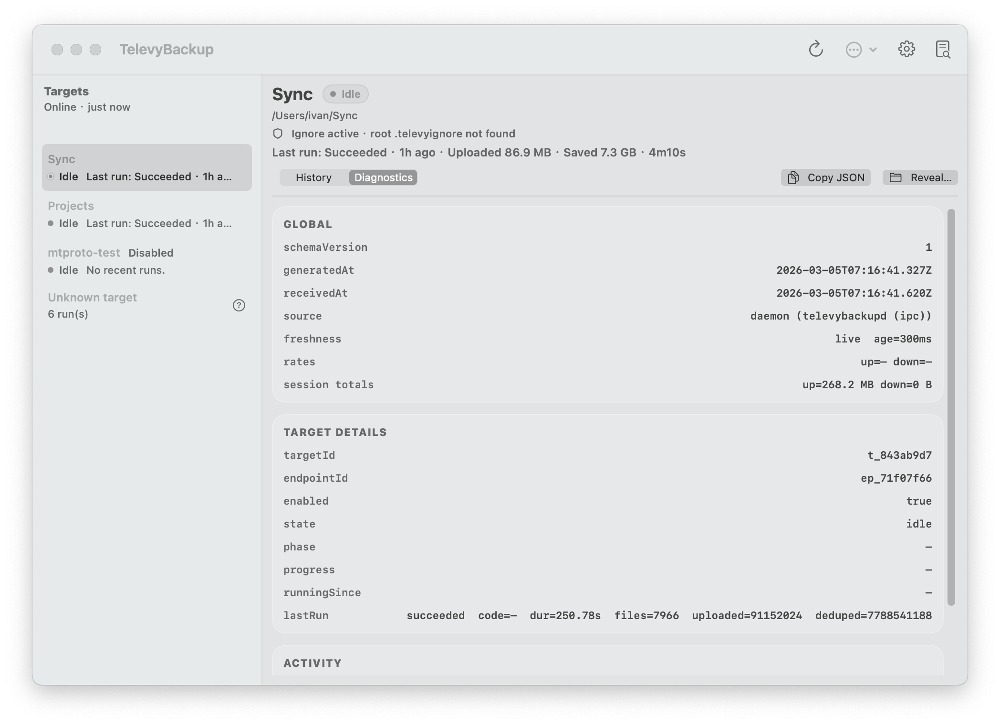
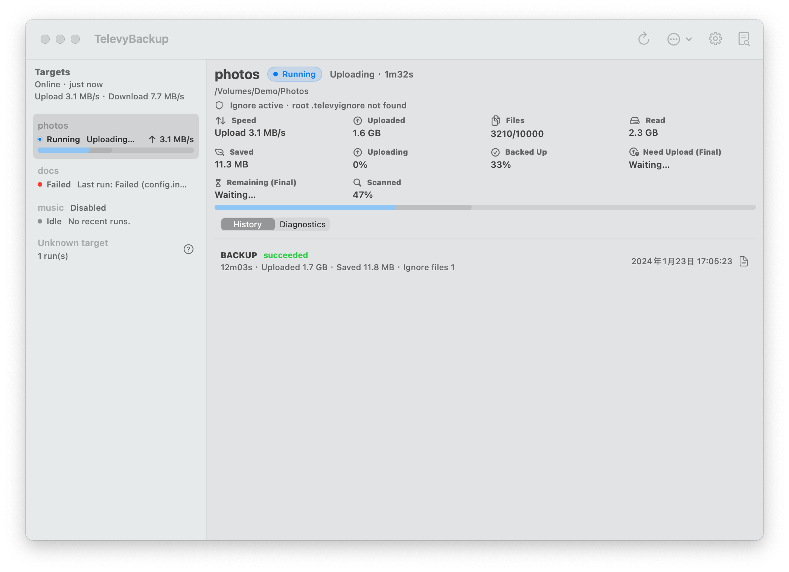

# 支持 `.televyignore` 的文件/目录忽略能力（#g7gt3）

## 状态

- Status: 已完成
- Created: 2026-03-04
- Last: 2026-03-05

## 背景 / 问题陈述

- 当前 backup 扫描会遍历 target 下所有文件，缺少用户可控的“按路径忽略”能力。
- 用户希望采用接近 `.gitignore` 的写法，便于快速迁移已有规则习惯，同时避免把忽略配置写进 `config.toml`。

## 目标 / 非目标

### Goals

- 支持在 target 源目录树内通过 `.televyignore` 定义忽略规则。
- 规则语义对齐 gitignore 常用与高级语法（含 `!` 反选与多级目录规则）。
- 同一规则集同时作用于：
  - backup 主扫描；
  - prepare 阶段 `compute_source_quick_stats`。
- 非法规则行不阻断备份：记录 warning 并忽略该行。

### Non-goals

- 不新增 `config.toml` 忽略字段；
- 不改 macOS Settings UI；
- 不改 `settings import-bundle --compare-folder` 行为（仍不应用 `.televyignore`）；
- 不引入默认忽略清单（例如 `.git`、`node_modules` 等）。

## 行为规格（Behavior Spec）

- 规则文件名固定为 `.televyignore`。
- 可在 source 根目录和任意子目录放置规则文件，按目录级联生效。
- 匹配作用域仅限 source 树内部；不读取 source 外父目录规则。
- 不读取 `.gitignore` / `.ignore` / 全局 gitignore / `.git/info/exclude`。
- 隐藏文件不会被隐式忽略；仅由显式规则控制。
- 当规则文件中出现非法模式：
  - 记录 `warn` 日志（含错误文本与规则文件上下文）；
  - 继续扫描，其余合法规则继续生效。
- 对非规则语法问题的 I/O/遍历错误，保持原有失败语义（瞬态 `NotFound` 仍 best-effort 跳过）。

## 验收标准（Acceptance Criteria）

- 含 `.televyignore` 的 source 运行 backup 后，被排除路径不会进入快照文件列表。
- `!` 反选规则可正确重新包含目标文件。
- 子目录 `.televyignore` 能覆盖上级规则（在 gitignore 语义允许前提下）。
- `compute_source_quick_stats` 与 backup 扫描后的文件统计口径一致。
- 非法规则行不会中断备份，且合法规则仍生效。
- 无规则文件时，隐藏文件仍会进入备份（无隐式排除）。

## 质量门槛（Quality Gates）

- `cargo test -p televy_backup_core`

## Visual Evidence (PR)

## Change log

- 2026-03-04: core 扫描改为 `.televyignore` 级联匹配；quick stats 对齐同一规则；新增 ignore 相关回归测试与 README 文档说明。
- 2026-03-05: backup `run.finish` 新增 ignore 汇总字段（`ignore_rule_files` / `ignore_invalid_rules`）；macOS 主界面补充 ignore 状态与历史摘要显示。
