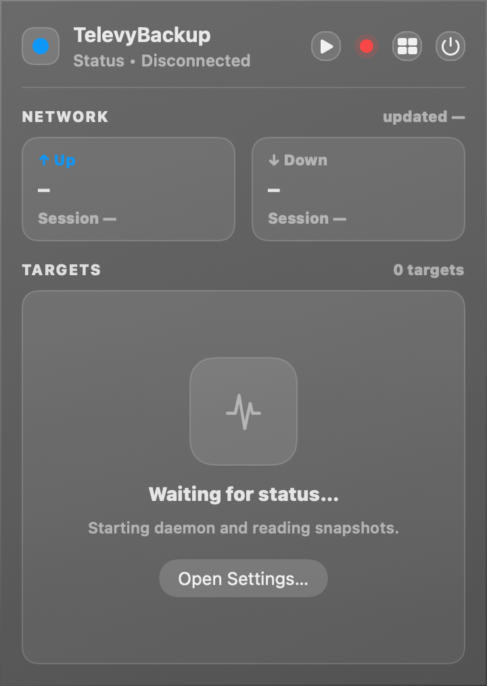
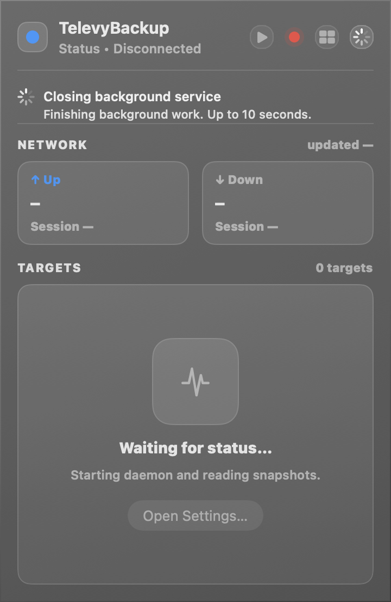

# Daemon 生命周期与可控退出（#k7d2v）

> 当前有效规范以本文为准；实现覆盖与当前状态见 `./IMPLEMENTATION.md`，关键演进原因见 `./HISTORY.md`。

## 背景 / 问题陈述

- macOS App 会启动状态流、CLI 任务和开发环境 daemon，但没有统一退出路径，导致 App 已退出而相关进程可能残留。
- `televybackupd` 仍是 scheduled backup 的共享守护进程，不能把 App 关闭等同于无条件停止后台服务。
- CLI 需要为命令所需的 IPC 提供临时启动能力，也需要显式管理长期运行的 daemon。

## 目标 / 非目标

### Goals

- 让 daemon 接受可认证的本地控制 IPC 停止请求，取消活动任务、回收 helper 并关闭所有本地资源。
- 为 App 提供统一的退出入口；定时任务已启用时，让用户选择仅退出 App 或完全退出。
- 提供 `televybackup daemon start|status|stop`，并使 CLI 临时启动行为不干扰已有共享实例。

### Non-goals

- 不删除 hourly/daily schedule，也不改变备份、恢复、校验的数据格式和 Telegram 协议。
- 不重命名 `televybackupd` 或引入第二套 worker。

## 范围（Scope）

### In scope

- daemon 停止请求、活动任务 `CancellationToken`、十秒优雅退出窗口和强制终止 fallback。
- App 顶部退出图标、`Command-Q`、定时任务确认对话框和 App-owned 进程回收。
- CLI 的 daemon 管理命令与 daemon-dependent 命令的临时启动。
- Homebrew LaunchAgent 的完全退出时 unload 语义和用户文档。

### Out of scope

- 新的定时策略、远端任务队列或多用户 IPC。
- 由 App 之外的进程启动的未受管理 daemon 的强制终止。

## 需求（Requirements）

### MUST

- `daemon.stop` 必须请求取消活动备份并使 daemon 退出；取消状态必须可追溯，资源和 Unix sockets 不得残留。
- App 无已启用 schedule 时必须执行完全退出；有已启用 schedule 时必须提供“退出 App”“完全退出”“取消”。
- 完全退出等待最多十秒；超时后只对本次确认归属的 daemon 使用强制终止 fallback。
- LaunchAgent 管理的 daemon 在完全退出时必须被 unload，避免 `keep_alive` 自动重启；恢复由 `televybackup daemon start` 或 `brew services start` 显式完成。
- `televybackup daemon start` 必须在 daemon IPC 可连接后返回；`stop` 与 App 完全退出共享同一优雅停止协议。
- CLI 临时启动只回收由该 CLI 进程创建的 daemon，绝不停止预先存在的共享实例。

### SHOULD

- 所有用户可见停止分支记录结构化日志，便于区分“仅退出 App”“优雅完全退出”和“超时强制终止”。

## 功能与行为规格（Functional/Behavior Spec）

### Core flows

- daemon 收到 `daemon.stop`：标记停止、取消活动任务；任务返回后关闭 IPC 服务和 storage cache，进程退出。
- App 触发退出：先停止 UI 状态流、轮询、重连任务和 UI 启动的 CLI。若 schedule 已启用，确认对话框决定是否保留 daemon；完全退出时调用 `daemon.stop`、必要时 unload LaunchAgent，并等待退出。
- CLI daemon-dependent 命令在 IPC 不可用时可临时启动 daemon 并在自身结束后回收；`daemon start` 是显式后台常驻入口。

### Edge cases / errors

- 停止请求与运行中任务并发时，任务以 cancelled 终态结束；无活动任务时立即进入服务收尾。
- IPC 不可达、daemon 未退出或 LaunchAgent 卸载失败必须给出明确错误，不能伪报完全退出成功。
- 仅退出 App 不得停止计划 daemon 或卸载 LaunchAgent。

## 接口契约（Interfaces & Contracts）

### 接口清单（Inventory）

| 接口（Name） | 类型（Kind） | 范围（Scope） | 变更（Change） | 契约文档（Contract Doc） | 负责人（Owner） | 使用方（Consumers） | 备注（Notes） |
| --- | --- | --- | --- | --- | --- | --- | --- |
| `daemon.stop` | rpc | internal | New | ./contracts/rpc.md | daemon | App, CLI | 请求取消并关闭 daemon |
| `televybackup daemon start|status|stop` | cli | external | New | ./contracts/cli.md | CLI | users, App scripts | start 在 IPC ready 后返回 |

### 契约文档（按 Kind 拆分）

- [RPC](./contracts/rpc.md)
- [CLI](./contracts/cli.md)

## 验收标准（Acceptance Criteria）

- Given daemon 空闲或正在备份，When 执行 `televybackup daemon stop`，Then daemon 在十秒内优雅退出，活动任务为 cancelled，且无 socket、lock 或 helper 残留。
- Given 已启用 schedule，When App 收到退出请求，Then 用户可以选择保留 daemon 的仅退出或取消任务并完全退出。
- Given Homebrew LaunchAgent 启动 daemon，When 用户选择完全退出，Then LaunchAgent 被 unload，daemon 不会被 keep-alive 重启。
- Given daemon-dependent CLI 命令发现 IPC 不可用，When 命令允许临时启动，Then 它只停止自身创建的实例。

## 非功能性验收 / 质量门槛

### Testing

- Rust unit/integration tests 覆盖 daemon stop、活动取消和 CLI 临时/常驻生命周期。
- Swift tests 覆盖退出决策和 App-owned 资源清理。
- macOS app build 与 Swift unit test script 通过。

### UI / Storybook (if applicable)

- No Storybook detected; 使用隔离 UI demo/snapshot 验证退出入口和确认对话框。

### Quality checks

- `cargo fmt --all -- --check`
- 相关 Rust tests 与 `scripts/macos/swift-unit-tests.sh`

## Visual Evidence

退出图标位于状态弹窗右上，使用隔离 UI demo 生成。

完全退出期间，界面阻止重复操作，并显示 daemon 正在收尾及十秒上限。

## Related PRs

- None

## 风险 / 开放问题 / 假设

- Homebrew LaunchAgent 的 unload 只发生在用户选择完全退出时。
- 十秒是用户确认的优雅退出上限；强制终止仅用于已确认归属的 daemon。

## 参考

- `crates/daemon/src/main.rs`
- `crates/core/src/control.rs`
- `macos/TelevyBackupApp/TelevyBackupApp.swift`
