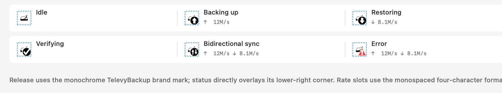
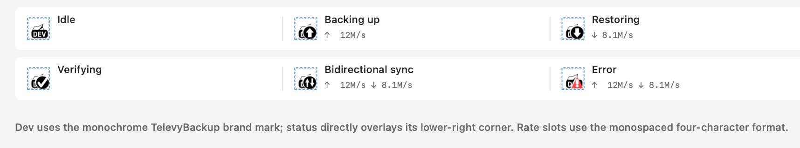
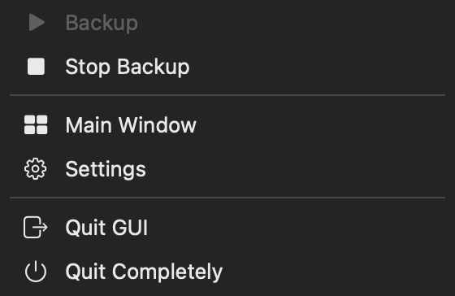
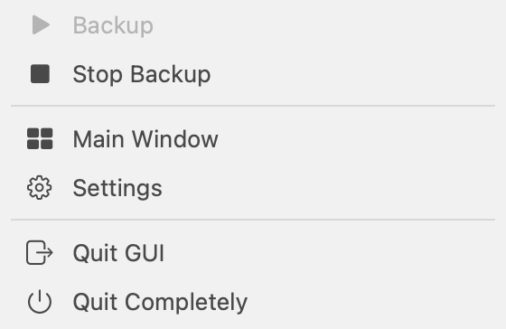

# macOS 菜单栏同步状态与传输速率

> 当前有效规范以本文为准；实现覆盖与当前状态见 `./IMPLEMENTATION.md`，关键演进原因见 `./HISTORY.md`。

## 背景 / 问题陈述

现有状态快照只表达目标的粗粒度 `state`、进度和瞬时速率。菜单栏不能可靠区分备份、恢复与验证，零速准备阶段和跨目标并发也会造成误判；历史失败记录还不能作为当前菜单栏错误。

本规范定义 daemon 到 macOS App 的显式活动契约，以及由该契约投影出的菜单栏状态。它让任务意图而非阶段名、速率或历史记录成为唯一状态依据。

## 目标 / 非目标

### Goals

- 在 `StatusSnapshot.targets[]` 增量公开可选 `activeTask`，声明任务种类和传输方向。
- 菜单栏稳定显示空闲、错误、备份中、恢复中、验证中和双向同步。
- 将当前 live 会话失败锁存 10 秒，且不从历史结果、禁用目标或重启后的快照恢复。
- 保持同一目标上的备份、恢复和验证互斥，允许跨目标并发并汇总为双向同步。
- 提供默认关闭、仅存于本机 `UserDefaults` 的菜单栏全局速率显示偏好。
- 提供不改变 daemon 所有权的菜单栏快捷菜单，用于全局备份、停止备份、打开界面与两种明确的退出语义。

### Non-goals

- 不改变备份、恢复、验证的数据传输算法、调度策略或速率计算公式。
- 不把菜单栏偏好写入 `config.toml`、导入导出包或远端存储。
- 不支持第一版中同一目标的多任务并发，也不依赖动画或颜色表达状态。

## 范围（Scope）

### In scope

- core status/control 协议、daemon runtime 活动态及外部任务终态。
- daemon 目标互斥准入和手动备份队列的延后执行。
- macOS 菜单栏纯投影、失败锁存、静态模板徽标、速率标题和设置偏好。
- 菜单栏左键 popover 与右键固定快捷菜单，及其基于 fresh 状态、请求进度和 GUI lifecycle gate 的可用性。
- Rust/Swift 自动化测试与受控菜单栏渲染证据。

### Out of scope

- 每个目标的下载速率菜单栏展示。
- 新的原生同步传输实现；本规范仅预留 `sync` 契约。
- 历史运行列表或目标页面既有失败语义的重做。

## 需求（Requirements）

### MUST

- `activeTask` 必须是 `StatusSnapshot` 的可选 additive 字段；旧快照在 Rust 与 Swift 解码后仍可用。
- `activeTask.kind` 只能是 `backup`、`restore`、`verify` 或 `sync`，`directions` 只能包含去重的 `up` 与 `down`。backup、restore、verify 的声明方向分别为 `["up"]`、`["down"]`、`[]`；sync 声明双向。
- 菜单栏状态优先级固定为：当前 live 失败锁存、双向同步、备份、恢复、验证、空闲。备份队列成员等同于备份活动。
- 失败锁存只可由当前 live 会话触发，并在 10 秒后失效：fresh 状态连接中已观察到的活动任务转为失败时触发；App 在当前进程中发起的本地任务收到 `state=failed` 时也触发，包含入场或预检失败。相同 live 任务的本地事件与 daemon 转变必须共享同一锁存期限；不同任务即使在同一目标上失败，也各自获得完整 10 秒。`lastRun`、初次收到的 snapshot `state=failed`、App 重启和 daemon 重启都不得触发它。
- 同一目标已有活动任务时，外部 `status.taskStart` 必须以稳定的 `target_busy` 错误拒绝；它不得启动恢复或验证的数据面工作。已在同目标运行外部任务时，排队备份必须保持等待，直至可获得该目标。
- 所有恢复和验证数据面入口必须在开始前绑定一个 daemon 目标并取得 `status.taskStart` 准入。通用 snapshot 命令以 snapshot 的 `source_path` 与 endpoint 解析唯一目标；元数据缺失、无匹配或歧义时必须失败关闭，不能绕过状态与互斥。
- `status.taskFinish` 只有在 daemon 应用了匹配终态、或证明是完全相同终态的幂等重放时才可确认成功。锁不可用、过期所有权、重启后丢失的运行时状态或不同终态不得被确认；数据面本身已经失败时，终态上报失败不得替换原始错误。
- 跨目标并发活动必须在全局投影中聚合；上行和下行同时存在时必须显示双向同步。
- 速率偏好默认关闭，键名为 `showMenuBarTransferRates`，只读 `global.up` 与 `global.down`。启用后只显示活动任务声明的方向；每个方向使用右对齐的四字符等宽速率槽，箭头与 `/s` 后缀不计入槽宽。错误徽标不得隐藏其他活动任务的速率标题。
- 左键只切换 popover。右键先关闭 popover，再按固定顺序显示 `Backup`、`Stop Backup`、分隔线、`Main Window`、`Settings`、分隔线、`Quit GUI`、`Quit Completely`。
- `Backup` 在状态缺失时可以先确保 daemon 可用；有 fresh status 时只在至少一个 enabled target、没有 lifecycle 或请求进行中、且没有未知 running task 时可用。动作以 `backup enqueue --all-enabled` 请求 daemon batch。
- `Stop Backup` 只在 supported `activeTask.kind=backup` 或 manual `backupQueue` 存在时可用，并调用全局 `backup.stop`；restore、verify 和 sync 不得被它误判为可停止备份。
- stale、disconnected、unknown/old running snapshot、进行中的 enqueue/stop、或 GUI lifecycle busy 时，相关 Backup/Stop Backup 动作必须禁用。快捷动作失败时必须恢复 popover 并显示错误，而不改变 daemon 状态。
- `Quit GUI` 直接执行 GUI-only exit；`Quit Completely` 在有 enabled schedule 时必须显示破坏性确认。GUI-only exit 不停止 daemon、LaunchAgent、daemon queue 或 GUI fallback daemon；complete exit 取消 GUI-owned local jobs，并只停止所选环境的 daemon。

### SHOULD

- 速率为零仍保留由 `activeTask` 或备份队列决定的活动状态。
- 菜单栏图标必须始终保留 `externaldrive` 作为产品主体。Idle 使用无透明占位的原始 `18 × 18pt` 画布；Dev Idle 必须保留既有 `externaldrive + DEV` 图像构成，不得改色、缩放、拉伸或调整徽标位置。活动状态保持同一 `18 × 18pt` 画布，并在原图右下直接叠加 `11 × 11pt` 单色圆形状态徽标；徽标外仅在与主体相接的左侧和上侧扣出 `12 × 12pt` 透明圆形净空轮廓，右侧和下侧直接贴合图像边界。内部再扣出箭头、勾选或双向箭头。主体本身不得改色或变形。错误状态的主盘体继续保持原色；同位置的右下警告标记只使用一种红色，感叹号以透明镂空呈现。
- 菜单栏图标必须按有限的视觉键缓存，并且只有键变化时才可写入 `button.image`。`effectiveAppearance` 通知只在失败图标的明暗视觉变体真实变化时生成一次新图；同键的回调不得再次写入或触发重绘反馈。
- 所有菜单栏状态映射应位于可脱离 AppKit 测试的纯 Swift 类型中。

### COULD

- 原生同步实现可通过 `kind=sync` 和双向 `directions` 无需修改菜单栏投影而接入。

## 功能与行为规格（Functional/Behavior Spec）

### Core flows

1. daemon 启动备份或接受外部任务时，为对应目标发布 `activeTask`；完成时清除该字段并记录外部任务的成功或失败终态。
2. macOS App 从 fresh status snapshot 聚合 `activeTask`、备份队列和本地 CLI 事件。它只将已见活动态后的失败转变交给内存失败锁存。
3. 菜单栏先选择唯一状态，再选择匹配状态的静态模板徽标。速率标题独立于徽标；每个活动方向占用固定的等宽槽，读数变化不会改变状态项宽度。
4. 设置开关写入 `UserDefaults`；App 重启后读取同一偏好，而 daemon、配置包和远端配置不感知该值。
5. 右键快捷菜单从相同的 status snapshot 和 lifecycle gate 投影 action availability；它不从历史 run 或任意 `running` 猜测 backup。失败的动作回到 popover 提示，不把菜单栏变成 daemon 控制通道。

### Edge cases / errors

- 初始快照中存在历史 `state=failed` 或 `lastRun.status=failed` 时，菜单栏仍按当前活动或空闲显示。
- 同时备份与恢复不同目标、或一个 `sync` 声明双向时，显示双向同步；单独验证显示验证中。
- 失败锁存期间若仍有活动任务，错误徽标优先，但已启用的有效方向速率继续显示。
- 速率槽使用二进制量级和单字符单位 `B/K/M/G/T/P/E`。`1.0K` 至 `9.9K` 保留一位小数，`10K` 至 `999K` 显示整数；当读数将超过四字符时立即进位。零值显示为 `0B`，缺失或无效值显示为 `----`；只有连接 stale 时才隐藏全部速率。
- unknown/old `activeTask` 不得使 App 崩溃；其字段按可选值容错，旧客户端忽略新增字段。
- GUI-only exit 被 CLI 或菜单请求时，GUI 必须拒绝 active sheet、未保存设置、GUI-owned local job 或并发 lifecycle 操作；CLI 不可用、GUI IPC 超时、daemon 未退出或 LaunchAgent 卸载失败时，complete exit 必须保持 GUI 运行。

## 接口契约（Interfaces & Contracts）

### 接口清单（Inventory）

| 接口（Name） | 类型（Kind） | 范围（Scope） | 变更（Change） | 契约文档（Contract Doc） | 负责人（Owner） | 使用方（Consumers） | 备注（Notes） |
| --- | --- | --- | --- | --- | --- | --- | --- |
| `targets[].activeTask` | status snapshot | internal | Modify | `./contracts/status-activity.md` | daemon/core | CLI, macOS App | additive-only |
| `status.taskStart` / `status.taskFinish` | control RPC | internal | Modify | `./contracts/status-activity.md` | daemon/core | CLI | task admission and terminal error code |
| `showMenuBarTransferRates` | macOS preference | local | New | `./contracts/status-activity.md` | macOS App | macOS App | UserDefaults only |
| menu-bar quick actions | macOS UI | local | New | `./contracts/status-activity.md` | macOS App | user | fixed actions with status-derived gating |

### 契约文档（按 Kind 拆分）

- [`./contracts/status-activity.md`](./contracts/status-activity.md)

## 验收标准（Acceptance Criteria）

- Given 缺少 `activeTask` 的旧快照，When Rust 或 Swift 解码，Then 保持可用且没有活动菜单栏状态。
- Given 同时存在上行与下行活动，When 投影菜单栏，Then 显示双向同步；零速不得改变活动状态。
- Given 当前连接已观察到活动任务转为失败，或当前 App 发起的本地任务失败，When 收到失败事件，Then 错误显示 10 秒；相同任务的双重观察不续期，不同任务独立计时；初始历史 snapshot 失败不得触发错误。
- Given 同一目标有 daemon 备份，When 外部恢复或验证申请开始，Then 收到 `target_busy` 且数据面不启动；不同目标可以同时工作。
- Given 通用恢复或验证命令无法从 snapshot 元数据解析唯一配置目标，When 命令进入准入阶段，Then 返回配置错误且不启动数据面。
- Given 已准入的外部任务结束，When `status.taskFinish` 的响应丢失，Then CLI 只接受 daemon 的精确幂等确认；Given 数据面失败且终态上报失败，Then CLI 保留数据面的原始失败码。
- Given 速率偏好关闭或开启，When 存在活动方向，Then 分别隐藏或显示每个声明方向的 `↑`/`↓` 四字符等宽二进制单位速率；数值、精度与量级变化不得改变同一方向段的宽度。
- Given 菜单栏收到与当前视觉键相同的 `effectiveAppearance` 通知，When 刷新图标，Then 不写入 `button.image`；Given 失败图标在浅色和深色之间切换，When 第一次进入新的视觉键，Then 只写入一次并复用该键缓存的图像。
- Given a fresh snapshot with a backup task or manual queue, When the user right-clicks the menu bar item, Then Stop Backup is enabled and calls `backup.stop`; Given restore, verify, sync, stale, or unknown running status, Then it is not enabled as Stop Backup.
- Given the menu bar item, When the user left-clicks or right-clicks, Then the former only toggles popover and the latter closes popover before showing the six fixed quick actions. GUI-only exit preserves daemon state; complete exit asks for destructive confirmation only when schedules are enabled.

## 验收清单（Acceptance checklist）

- [x] 核心路径的长期行为已被明确描述。
- [x] 关键边界/错误场景已被覆盖。
- [x] 涉及的接口/契约已写清楚。
- [x] 相关验收条件已经可以用于实现与 review 对齐。

## 非功能性验收 / 质量门槛（Quality Gates）

### Testing

- Rust：status JSON 兼容性、控制 IPC 入参/终态和目标互斥。
- Swift：状态矩阵、失败锁存、偏好持久化和速率标题。
- Full：`cargo fmt --all -- --check`、`cargo clippy --all-targets --all-features -- -D warnings`、`cargo test --all-features`、`scripts/macos/swift-unit-tests.sh`、`scripts/macos/build-app.sh`。

### UI / Storybook (if applicable)

- 通过受控 AppKit 菜单栏预览渲染空闲、上传、下载、双向、验证和错误状态；不需要 Storybook。

## Visual Evidence

Release 受控菜单栏预览。

PR: include

Dev 受控菜单栏预览。

PR: include

菜单栏快捷菜单受控预览（Backup 禁用、Stop Backup 可用）。

PR: include

PR: include

## Related ADRs

- [0001-explicit-menu-bar-activity-directions](../../adr/0001-explicit-menu-bar-activity-directions.md)
- [0002-gui-only-handoff-control-plane](../../adr/0002-gui-only-handoff-control-plane.md)

## Related PRs

- None

## 风险 / 开放问题 / 假设（Risks, Open Questions, Assumptions）

- 风险：`activeTask` 和备份队列的运行权威必须保持在 daemon，App 只能投影。
- 风险：失败锁存属于客户端内存状态，任何持久化都会把历史失败误报为当前错误。
- 需要决策的问题：None。
- 假设：App、CLI 与 daemon 作为同一发行物同步升级，但旧 status snapshot 仍可能在开发与诊断中出现。

## 参考（References）

- `../../plan/0010:status-popover-dashboard/contracts/events.md`
- `../../plan/0011:daemon-status-ipc/contracts/events.md`
- `../../../CONTEXT.md`
- `../../adr/0001-explicit-menu-bar-activity-directions.md`
